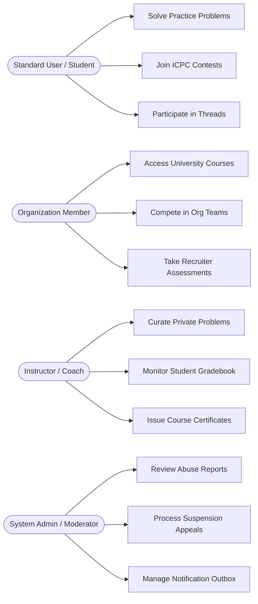
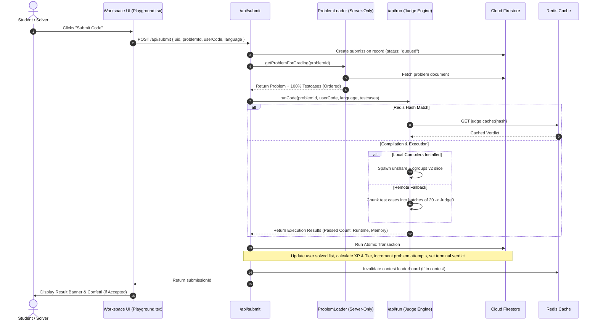
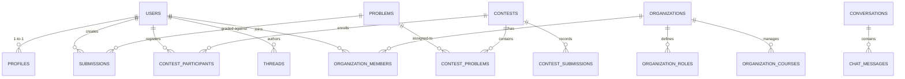

# BeastCode Platform: Comprehensive Technical Reference & Handover Document

> **Document Type:** Production Architecture Audit, Engineering Reference, and Practical Handover Specification  
> **Repository:** `leetcode-clone-youtube` (`leetcode-yt` v0.1.0)  
> **Canonical Target File:** `PROJECT_SUMMARY.md`  
> **Inspection Date:** September 22, 2026  
> **Inspected Git Revision:** `d7603da` (Branch: `master`, Tracking: `origin/master`, Status: Clean)  
> **Production Deployment:** `https://www.bomboclatbeastcode.codes`  
> **Primary Authors / Maintainers:** Juan Luong (`luongjuan123`) & Collaborators  

---

## Table of Contents

1. [Executive Overview and Project Identity](#1-executive-overview-and-project-identity)
2. [Problem, Users, Scope, and Domain Concepts](#2-problem-users-scope-and-domain-concepts)
3. [Repository and Technology Map](#3-repository-and-technology-map)
4. [System Architecture and Component Relationships](#4-system-architecture-and-component-relationships)
5. [Feature Inventory and Implementation Status](#5-feature-inventory-and-implementation-status)
6. [Detailed Workflow Walkthroughs](#6-detailed-workflow-walkthroughs)
   - 6.1 Code Execution and Authoritative Submission Grading
   - 6.2 ICPC-Style Contest Management, Live Standings, and Anti-Cheat Proctoring
   - 6.3 Multi-Tenant Institutional Workspaces (Universities and Corporations)
   - 6.4 Authentication, Idempotent Account Provisioning, and Security
   - 6.5 Moderation, Warning Escalation, Suspension, and Appeals
7. [Frontend and User-Facing Interface](#7-frontend-and-user-facing-interface)
8. [Backend, Services, APIs, and Event Contracts](#8-backend-services-apis-and-event-contracts)
9. [Data Model, Persistence, and Cloud Firestore Schema](#9-data-model-persistence-and-cloud-firestore-schema)
10. [Core Algorithms and Distinctive Technical Logic](#10-core-algorithms-and-distinctive-technical-logic)
11. [Machine Learning and AI Components](#11-machine-learning-and-ai-components)
12. [Hardware, Robotics, and Embedded Components](#12-hardware-robotics-and-embedded-components)
13. [Authentication, Authorization, and Trust Boundaries](#13-authentication-authorization-and-trust-boundaries)
14. [Reliability, Performance, and Operational Behavior](#14-reliability-performance-and-operational-behavior)
15. [Configuration, Setup, Build, and Deployment](#15-configuration-setup-build-and-deployment)
16. [Tests, Validation, and Quality Evidence](#16-tests-validation-and-quality-evidence)
17. [Design Decisions, Constraints, and Tradeoffs](#17-design-decisions-constraints-and-tradeoffs)
18. [Current Limitations, Defects, and Unfinished Work](#18-current-limitations-defects-and-unfinished-work)
19. [Prioritized Next Steps and Practical Handover](#19-prioritized-next-steps-and-practical-handover)
20. [Unknowns, Source Index, and Coverage Statement](#20-unknowns-source-index-and-coverage-statement)
21. [Compact Context for a Future Developer or AI Agent](#21-compact-context-for-a-future-developer-or-ai-agent)

---

## 1. Executive Overview and Project Identity

### 1.1 What the Project Is
**BeastCode** (registered in `package.json` as `leetcode-yt` at version `0.1.0`) is a full-stack, enterprise-grade online judge, competitive programming, and institutional educational management platform. Built upon Next.js 13 (Pages Router), TypeScript 5, Tailwind CSS, Google Cloud Firestore, Redis, and Firebase Authentication, BeastCode transcends generic code practice clones by offering a multi-tiered execution engine, formal ICPC contest proctoring with client-side anti-cheat enforcement, full multi-tenant institutional suites for university departments and enterprise technical recruiters, a threaded discussion forum with rich media and polls, and an end-to-end transactional email and notification queuing pipeline.

### 1.2 Core Problem Addressed
Standard educational code assessment tools and toy LeetCode clones suffer from critical structural weaknesses:
1. **Unsafe / Naive Execution:** Many online judges evaluate untrusted user code in unconstrained Node.js environments or rely solely on public third-party APIs without fallback mechanisms, custom memory cgroups, or special judge support.
2. **Lack of Institutional Tenancy:** Educational institutions and tech employers are forced to use disparate tools for problem curation, classroom homework assignment, candidate screening, proctored exams, and student progress tracking.
3. **Contest Integrity Gaps:** Typical clones lack proctoring mechanisms to detect browser unfocusing, window blurring, and unauthorized multi-tab navigation during timed assessments.
4. **Data Leakage:** Naive Next.js implementations often expose confidential test cases and solutions within client-side bundles (`__NEXT_DATA__`).

BeastCode solves these challenges through:
- A **Dual-Path Sandboxed Judge Engine** combining local Linux kernel namespaces (`unshare`) and control groups (`cgroups v2`) with remote Judge0 CE / Extra-CE cluster fallback.
- An **Authoritative Multi-Tenant Organization Suite** supporting custom roles, courses, roadmaps, gradebooks, assessments, and verifiable certificate issuance.
- **Client-Side Anti-Cheat Proctoring** with fullscreen lock, window-blur counters, and automatic session disqualification.
- Strict **Data Sanitization and Tiered Loaders** that permanently strip confidential grading test cases from public client DTOs.

### 1.3 Project Type and Maturity
- **Observed Architecture:** Web application with serverless API microservices deployed on Google Cloud Run via Firebase App Hosting.
- **Current Maturity:** **Production-Grade Advanced Pilot / Feature-Complete Platform**. 
  - The working tree is clean on branch `master` at commit `d7603da`.
  - Static type checking via `npx tsc --noEmit` passes with **0 errors**.
  - ESLint analysis via `npm run lint` passes with **0 fatal errors** (only minor warnings regarding Next.js `` optimization and hook dependency arrays).
  - The database layer enforces **38 distinct Cloud Firestore collections** guarded by 350 lines of declarative security rules in `firestore.rules` and 307 composite index definitions in `firestore.indexes.json`.

### 1.4 What a New Contributor Most Needs to Understand
Before making changes, maintainers must recognize that:
1. **Client DTOs vs. Authoritative Grader DTOs are Separated:** Never import `src/utils/problemLoader.ts`'s `getProblemForGrading` on client pages. Only `getPublicProblem` is client-safe. Confidential inputs/outputs must never enter client props.
2. **All Server-Side Administrative Mutations Must Route Through Firebase Admin:** Client Firestore rules explicitly forbid standard users from mutating global problems, contest parameters, or other users' profile records.
3. **Execution Routing is Dynamic:** The judge automatically switches between local Linux compilers (`g++`, `gcc`, `javac`, `python3`) and remote Judge0 APIs based on binary availability on the hosting server.
4. **Submissions Execute Atomically:** Grading updates user experience points, tier ranks, solve counters, and problem attempt metrics in a single Firestore database transaction.

---

## 2. Problem, Users, Scope, and Domain Concepts

### 2.1 User Personas and Roles



1. **Competitive Programmer / Student:**
   - Browses problem lists filtered by difficulty (Easy, Medium, Hard, ML) and categorized tags.
   - Solves problems in 5 supported languages: JavaScript, Python, C++, C, Java.
   - Competes in live or virtual contests with ICPC scoring and anti-cheat tracking.
   - Earns XP, levels up across 10 defined mastery tiers (Newbie to Mythic), and climbs global leaderboards.
2. **Academic Instructor / Coach (University Tenant):**
   - Creates and administers private educational organizations (`orgs/[slug]`).
   - Defines custom organizational roles with granular permissions (`organization.manageCourses`, `organization.assignHomework`).
   - Organizes roadmaps with weekly modules, lecture resources (PDF, video, markdown), and assignments.
   - Tracks student grades in real-time gradebooks and issues cryptographically verifiable completion certificates.
3. **Corporate Recruiter (Enterprise Tenant):**
   - Publishes technical job vacancies and manages applicant pipelines.
   - Configures timed, private coding assessments and mock interviews.
   - Evaluates candidate execution metrics, runtime efficiency, and code quality.
4. **Platform Administrator & Moderator:**
   - Manages global problem catalogues, special judge validator scripts, and execution profile limits.
   - Enforces trust and safety policies: reviews user reports, issues formal warnings, enacts temporary or permanent suspensions, and audits appeals.
   - Monitors operational health, inspects Redis standings caches, and supervises the transactional email queue.

### 2.2 Domain Entities and Glossary

- **Problem:** An algorithmic programming challenge containing statement markdown, constraints, starter code templates, sample test cases, secret grading suites, execution limits, and optional custom verifiers (special judge).
- **Execution Profile (`ExecutionProfile`):** Preset runtime and resource limits (`fast`, `normal`, `long`, `machine_learning`) defining CPU timeouts (500ms to 15,000ms), memory limits (64MB to 1024MB), and stdout size caps (8KB to 256KB).
- **Contest (`Contest`):** A scheduled competitive event with strict start/end timestamps, penalty rules (e.g., 20 minutes per rejected submission), freeze windows (obscuring live ranks during final minutes), and anti-cheat security levels.
- **Virtual Participation:** A simulation mode allowing contestants to take past contests with an individual countdown timer while competing against historical participant submissions.
- **Anti-Cheat Integrity Event:** A telemetry record capturing browser tab blurs, fullscreen exits, or window deviations during proctored exams. Exceeding warning thresholds triggers automated termination.
- **Organization (`Organization`):** An isolated multi-tenant workspace with unique slug, custom roles, private problem repository, team structures, announcements, and asset storage.
- **Special Judge (`customChecker`):** A domain-specific test validator script written in Python or C++ executed when problem verdicts require floating-point tolerance or non-unique valid outputs.

---

## 3. Repository and Technology Map

### 3.1 Technology Stack Matrix

| Layer | Technology | Version | Purpose in BeastCode |
| :--- | :--- | :--- | :--- |
| **Framework** | Next.js | `13.2.4` | Server-Side Rendering (SSR), Static Generation (ISR), API Route Handlers |
| **Runtime & Language** | Node.js / TypeScript | `v24.16.0` / `5.0.2` | Primary server runtime and static type checking across 100% of source files |
| **Client UI & Styling** | Tailwind CSS / PostCSS | `3.2.7` / `8.4.21` | Dark-first design system, custom themes (Dark, Light, Sakura, Red), glassmorphism |
| **Global State** | Recoil | `0.7.7` | Reactive state atoms for modals, code execution status, composer drawer |
| **Primary Persistence** | Cloud Firestore | SDK `9.18.0` / Admin `13.10.0` | NoSQL document store powering 38 distinct collections |
| **In-Memory Cache** | Redis (`ioredis`) | `5.11.1` | Contest leaderboard caching, dirty invalidation flags, execution hashing |
| **Code Editor** | CodeMirror 6 | `4.19.16` | Web code editor with syntax highlighting for C++, C, Java, JS, Python |
| **Local Sandboxing** | Linux Namespaces & Cgroups v2 | Native OS | `unshare` subprocess isolation with CPU, memory, and pid quota enforcement |
| **Remote Judge** | Judge0 CE / Extra CE | REST API | Distributed cloud compilation and execution fallback engine |
| **Email & Delivery** | Nodemailer | `8.0.11` | SMTP outbox dispatcher with exponential retry backoff and Ethereal fallback |
| **Monetization** | Stripe | `22.2.0` | Payment intents and hosted checkout sessions for infrastructure donations |
| **Hosting & Infra** | Firebase App Hosting | Cloud Run | Containerized serverless application hosting on Google Cloud |

### 3.2 Directory and File Responsibility Index

```
leetcode-clone-youtube/
├── apphosting.yaml                    # Cloud Run serverless deployment config
├── firebase.json                      # Firebase CLI configuration
├── firestore.indexes.json             # Composite index definitions (307 lines)
├── firestore.rules                    # Security rules engine (350 lines, 38 collections)
├── next.config.js                     # Next.js image domain, redirect, and auth rewrite rules
├── package.json                       # Dependencies and lifecycle scripts
├── tailwind.config.js                 # Theme tokens, custom gradients, and keyframe animations
├── tsconfig.json                      # Compiler options and path alias mappings (@/* -> ./src/*)
├── scripts/                           # Maintenance, migration, and inspection scripts
│   ├── check-threads.mjs              # Discussion forum integrity checks
│   ├── db-cleanup-migration.mjs       # Database pruning and orphaned document migration
│   ├── migrate-org-avatars.js         # Base64 avatar migration to GCS storage paths
│   ├── seed-tags.mjs                  # Seed official problem and thread taxonomy tags
│   └── test-grading-pipeline.ts       # Comprehensive regression test suite for grader loader
├── src/
│   ├── atoms/                         # Recoil state stores (authModalAtom, executionStateAtom, etc.)
│   ├── components/                    # Component architecture (Admin, Chat, Workspace, etc.)
│   ├── context/                       # React Contexts (SubmissionContext, RealtimeNotificationProvider)
│   ├── firebase/                      # Client (firebase.ts) and Admin (firebaseAdmin.ts) SDK initializers
│   ├── hooks/                         # Custom hooks (useAdmin, useContestStandings, useMessages, etc.)
│   ├── pages/                         # Pages Router UI views and 135+ REST API routes
│   ├── styles/                        # Theme tokens and global stylesheets
│   └── utils/                         # Business logic engines (orgEngine, emailService, runCode, etc.)
```

---

## 4. System Architecture and Component Relationships

### 4.1 Topology Diagram

```mermaid
graph TB
    subgraph Browser Client
        UI[Next.js React UI]
        CM[CodeMirror 6 Editor]
        AC[Anti-Cheat Monitor]
        RecoilStore[Recoil & Context State]
    end

    subgraph Firebase Cloud Platform
        Auth[Firebase Auth Service]
        Firestore[(Cloud Firestore - 38 Collections)]
        Storage[Firebase Cloud Storage]
    end

    subgraph Backend Serverless API Next.js
        APIRun["/api/run (Sandbox Engine)"]
        APISubmit["/api/submit (Grading Pipeline)"]
        APIOrg["/api/organizations/* (Multi-Tenancy)"]
        APIChat["/api/chat/* (Real-Time Messaging)"]
        APIEmail["/api/notifications/dispatch (Mailer)"]
    end

    subgraph Caching & Remote Services
        Redis[(Redis Cache Instance)]
        Judge0[Judge0 CE / Extra-CE Cluster]
        StripeAPI[Stripe Payments API]
        SMTP[SMTP Mail Relay]
    end

    UI -->|HTTP / REST| Backend Serverless API Next.js
    UI -->|Direct SDK Read/Write| Firestore
    UI -->|Sign In / Verify| Auth
    AC -->|Log Tab/Fullscreen Violations| Firestore

    APIRun -->|Check Local CLI| LocalRunner{Local Compilers Available?}
    LocalRunner -->|Yes: unshare + cgroups| Sandbox[Linux Native Sandbox]
    LocalRunner -->|No: HTTP Batch| Judge0
    APIRun -->|Cache Verdict Hash| Redis

    APISubmit -->|Atomic Transaction| Firestore
    APISubmit -->|Invalidate Standings| Redis

    APIEmail -->|Enqueues Outbox Item| Firestore
    APIEmail -->|Processes Tasks| SMTP
```

### 4.2 Component Boundary Analysis
1. **Client vs. Serverless API:**
   - Low-latency interactions, UI rendering, client-side filtering, and real-time thread listeners interact directly with Cloud Firestore using Firebase Client SDK, guarded by `firestore.rules`.
   - All security-sensitive operations (compilation, grading, account provisioning, password reset verification, organization role assignment, ban enforcement) execute on Next.js API routes powered by the Firebase Admin SDK.
2. **Database vs. Cache:**
   - Cloud Firestore serves as the source of truth for persistent entities (users, problems, submissions, organizations).
   - Redis functions as a high-throughput cache for contest leaderboards (`contest:{cid}:standings`), preventing Firestore read exhaustion during live contests, and stores submission verdict hashes (`judge:cache:{sha256}`) to skip redundant code execution.

---

## 5. Feature Inventory and Implementation Status

| Feature Area | Capability | Implementation Status | Verification Evidence | Key Source Files |
| :--- | :--- | :--- | :--- | :--- |
| **Code Execution** | Local Sandboxing (`unshare` + cgroups v2) | Implemented | Source inspected | `src/pages/api/run.ts:437-495` |
| **Code Execution** | Remote Judge0 Batch Fallback | Implemented | Source inspected | `src/pages/api/run.ts:167-350` |
| **Code Execution** | Special Judge (Python & C++ Scripts) | Implemented | Source inspected | `src/pages/api/run.ts:1182-1246` |
| **Code Execution** | Redis Execution Hash Caching | Implemented | Source inspected | `src/pages/api/run.ts:1056-1108` |
| **Problem Management** | Authoritative Grader vs Public DTO Stripping | Implemented | Tested (`scripts/test-grading-pipeline.ts`) | `src/utils/problemLoader.ts:17-201` |
| **Problem Management** | Problem Tag Taxonomy System | Implemented | Source inspected, rules enforced | `src/pages/api/problem-tags.ts`, `firestore.rules` |
| **Contest Ecosystem** | ICPC Standings & Penalty Calculation | Implemented | Source inspected | `src/utils/leaderboardCalc.ts:14-129` |
| **Contest Ecosystem** | Leaderboard Freeze Window | Implemented | Source inspected | `src/pages/api/cron/calculate-standings.ts:60-75` |
| **Contest Ecosystem** | Virtual Participation Mode | Implemented | Source inspected | `src/pages/contests/[cid]/problems/[pid].tsx:99-103` |
| **Contest Integrity** | Fullscreen Lock & Window Blur Detection | Implemented | Source inspected | `src/pages/contests/[cid]/problems/[pid].tsx:51-68` |
| **Multi-Tenancy** | Organization Engine & Custom RBAC | Implemented | Source inspected | `src/utils/orgEngine.ts:1-520` |
| **Multi-Tenancy** | University Suites (Courses, Roadmaps, Gradebook) | Implemented | Source inspected | `src/pages/orgs/[slug].tsx`, `src/utils/orgEngine.ts` |
| **Multi-Tenancy** | Recruiter Suites (Vacancies, Assessments, Interviews)| Implemented | Source inspected | `src/pages/api/organizations/[id]/assessments/` |
| **Community** | Threaded Discussions, Polls, Media & Cards | Implemented | Source inspected | `src/components/Threads/Threads.tsx`, `ThreadCard.tsx` |
| **Real-Time Chat** | Messaging, Audio Notes, Code Snippets, Reactions | Implemented | Source inspected | `src/components/Chat/`, `src/pages/api/chat/` |
| **Trust & Safety** | User Reports, Warnings, Bans, 14-Day Deletions | Implemented | Source inspected | `src/utils/moderationConfig.ts`, `authMiddleware.ts` |
| **Notifications** | Transactional Outbox Queue with Exponential Backoff | Implemented | Source inspected | `src/utils/emailService.ts:21-120` |
| **Monetization** | Stripe Hosted Checkout & Card Intent Processing | Implemented | Source inspected | `src/pages/api/create-checkout-session.ts` |

---

## 6. Detailed Workflow Walkthroughs

### 6.1 Code Execution and Authoritative Submission Grading



#### Step-by-Step Implementation Detail:
1. **Trigger:** The contestant presses "Submit" in `src/components/Workspace/Playground/Playground.tsx`.
2. **Endpoint Invocation:** A POST request hits `src/pages/api/submit.ts` containing `uid`, `problemId`, `userCode`, `language`, and optional `contestId`.
3. **Queue Ingestion:** `submit.ts` creates or merges a record in `submissions` (or `contest_submissions`) with `status: "queued"`.
4. **Server-Side Test Case Hydration:** `getProblemForGrading(problemId)` in `src/utils/problemLoader.ts` pulls the authoritative problem definition. If no test cases are configured, the submission terminates immediately with a `Configuration Error`.
5. **Execution Routing (`src/pages/api/run.ts`):**
   - The SHA-256 hash of `${normalizedCode}|${language}|${problemId}|${updatedAt}` is checked against Redis key `judge:cache:${hash}`.
   - If missing, the runner checks for local compiler binaries (`g++`, `gcc`, `javac`, `python3`). If missing, it dispatches HTTP batch requests to Judge0 (`ce.judge0.com` or `extra-ce.judge0.com` for Python ML) in chunks of 20.
   - For local execution, Linux `unshare` isolates network, PID, and mounts, while cgroups v2 caps memory (`memory.max`), swap (`memory.swap.max: 0`), and pids (`pids.max`).
6. **Verdict Evaluation:** Standard outputs are normalized and compared against expected outputs. If `customChecker` is enabled, a custom Python or C++ special judge binary executes with 5-second CPU guardrails.
7. **Atomic Persistence:** In a single Firestore transaction:
   - User document `users/{uid}` updates: if newly solved, `easyCount`/`mediumCount`/`hardCount`/`mlCount` increment.
   - Experience points are recomputed via `calculateExperience` in `src/utils/experienceConfig.ts`, updating `score`, `xp`, and `experienceLevel`.
   - Problem record `problems/{problemId}` updates: `attempts` increments, and `solved` increments on first solve.
   - Submission record marks `isTerminal: true`, records runtime and memory, and sanitizes hidden test case details (`cleanResult.isSecret = true`).

---

### 6.2 ICPC-Style Contest Management, Live Standings, and Anti-Cheat Proctoring

1. **Contest Enrollment & Lifecycle:**
   - Contests in `contests/{cid}` transition through states: `upcoming`, `running`, `frozen`, `ended`.
   - Contestants register in `contest_participants/{cid}_{uid}`. `firestore.rules` enforces that once terminated by security rules, a participant cannot self-re-enable.
2. **Anti-Cheat Proctoring Engine (`src/pages/contests/[cid]/problems/[pid].tsx`):**
   - When a contest's `securityLevel` is set to `Strict` or `Exam`, the UI enforces browser fullscreen mode (`document.documentElement.requestFullscreen()`).
   - Event listeners track `fullscreenchange` and `window.onblur`.
   - Deviations trigger immediate warnings in the UI and log an event to `contest_integrity_events`.
   - When warnings exceed `contest.maxWarnings` (typically 3), the participant's status is atomically flipped to `terminated`, locking them out of the problem workspace.
3. **Leaderboard & Tie-Breaking Engine (`src/utils/leaderboardCalc.ts`):**
   - Live standings aggregate total solved problems and total penalty minutes.
   - **ICPC Penalty Formula:** 
     $$\text{Penalty} = (\text{Solve Time} - \text{Contest Start Time}) + (20 \text{ minutes} \times \text{Rejected Submissions Prior to Acceptance})$$
   - Terminated participants are excluded from official standings.
4. **Leaderboard Freeze & Cron Synchronization (`src/pages/api/cron/calculate-standings.ts`):**
   - During the final `leaderboardFreeze` minutes of a contest, live standings calculations cease writing to the public leaderboard.
   - A frozen snapshot is locked into Redis key `contest:{cid}:standings:frozen` with a 24-hour TTL, obscuring final ranks until the contest officially ends.

---

### 6.3 Multi-Tenant Institutional Workspaces

```mermaid
graph TD
    Org[Organization Entity] --> Roles[System & Custom Roles]
    Org --> Academic[Academic Suite - University]
    Org --> Enterprise[Enterprise Suite - Corporate]

    Roles --> Owner[Owner - Priority 100]
    Roles --> Admin[Admin - Priority 90]
    Roles --> Coach[Coach - Priority 85]
    Roles --> Instructor[Instructor - Priority 85]
    Roles --> TA[Teaching Assistant - Priority 80]
    Roles --> Member[Member - Priority 50]

    Academic --> Courses[Courses & Syllabuses]
    Academic --> Roadmaps[Weekly Roadmaps & Material]
    Academic --> Gradebook[Student Gradebook & Analytics]
    Academic --> Certificates[Verifiable Certificate Issuer]

    Enterprise --> Vacancies[Job Vacancies & Pipelines]
    Enterprise --> Assessments[Timed Private Coding Assessments]
    Enterprise --> Interviews[Live Coding Interview Rooms]
```



- **Tenancy Isolation:** Managed via `src/utils/orgEngine.ts` and `src/pages/orgs/[slug].tsx` (5,187 lines of frontend workspace logic).
- **Role Hierarchy:** Ten distinct role templates (`SYSTEM_ROLES_TEMPLATES`) define priorities from 10 (Guest) to 100 (Owner). Permissions check dynamically across 23 distinct permission strings (e.g., `organization.manageCourses`, `organization.issueCertificates`).
- **Academic Suite:** Instructors build multi-week roadmaps linking algorithm problems, lecture PDFs, and video links. Student completion is tabulated into institutional gradebooks.
- **Enterprise Suite:** Recruiters configure private problem assessments with strict deadlines, reviewing applicant candidate scorecards, runtime efficiency percentiles, and code submissions.

---

### 6.4 Authentication, Idempotent Account Provisioning, and Security

1. **Authentication Flow:** Users authenticate via Firebase Auth (Email/Password, Google OAuth, GitHub OAuth). Navigation destinations are sanitized via `src/utils/sanitizeUrl.ts` (`getSafeRedirectUrl`) preventing open redirects and infinite `/auth` loops.
2. **Authoritative State Coordinator (`src/pages/_app.tsx` & `src/utils/onboarding.ts`):**
   - Centralized `GlobalAuthAndProfileCheck` coordinates session initialization, verification, moderation, and onboarding without listener churn (listeners decoupled from route navigation).
   - `isUserOnboarded(userData)` provides canonical reconciliation:
     - Confirms explicit `isOnboarded === true`.
     - Preserves legacy accounts (`isOnboarded === undefined`) with established username/displayName and solve activity, eliminating unexpected onboarding re-prompts.
     - Detects genuinely incomplete newly provisioned accounts (`isOnboarded === false`).
   - Profile setup modal (`src/components/Modals/ProfileSetupModal.tsx`) provides full dismissibility (Close button, Escape key, backdrop click), stable loading skeleton, and independent developer mode alongside academic university profiling.
3. **Idempotent Profile Provisioning (`src/pages/api/auth/provision.ts`):**
   - Client sends Firebase Bearer ID Token to `/api/auth/provision`.
   - Token must have `email_verified == true`.
   - Fast-path check: if `users/{uid}` already exists, immediately returns HTTP 200 `{ success: true, alreadyProvisioned: true }` without consuming rate-limit tokens.
   - For new accounts, enforces an in-memory rate limit (10 requests per UID per hour).
   - In a single atomic Firestore transaction, **18 distinct documents** are provisioned simultaneously to ensure relational consistency across features:
     1. `users/{uid}`
     2. `profiles/{uid}`
     3. `settings/{uid}`
     4. `statistics/{uid}`
     5. `solvedProblems/{uid}`
     6. `contestHistory/{uid}`
     7. `threads/{uid}`
     8. `notifications/{uid}`
     9. `notificationSettings/{uid}`
     10. `security/{uid}`
     11. `sessions/{uid}`
     12. `organizationMembership/{uid}`
     13. `achievements/{uid}`
     14. `bookmarks/{uid}`
     15. `preferences/{uid}`
     16. `theme/{uid}`
     17. `language/{uid}`
     18. `privacy/{uid}`
   - The provisioning event is logged to `securityLogs`.
   - Session tracking (`/api/security/sessions`) guards against transient token expiration by performing token refresh prior to sign-out.

---

### 6.5 Moderation, Warning Escalation, Suspension, and Appeals

1. **Report Submission:** Users report offending threads, comments, or chat messages via `/api/moderation/report`. Enforces a 10-minute cooldown and a maximum of 5 reports per user per day (`moderationConfig.ts`).
2. **Warning Escalation:** Admins issue warnings (`moderationWarnings`). Accumulating 3 active warnings within 30 days triggers automatic account suspension (`status: "BANNED"`).
3. **Suspension Enforcement:** `withAuthAndModeration` middleware in `src/utils/authMiddleware.ts` intercepts incoming requests. Banned users are returned HTTP 403 with reason, case reference ID, and appeal instructions.
4. **Appeals & Deletions:** Banned users can access `/account-appeal` and submit appeals to `/api/moderation/appeal`. Deletion requests (`/api/moderation/self-delete`) enter a 14-day grace period (`PENDING_DELETION`) before permanent purging by admin cron jobs.

---

## 7. Frontend and User-Facing Interface

### 7.1 Architecture and Route Inventory

The frontend is implemented using the Next.js Pages Router with TypeScript. All routes reside in `src/pages/`:

| Route Path | View Component / Page | Access Level | Description |
| :--- | :--- | :--- | :--- |
| `/` | `src/pages/index.tsx` | Public | Homepage, problem catalogue table, category filters, solved status |
| `/problems/[pid]` | `src/pages/problems/[pid].tsx` | Public | Main problem workspace: split-screen statement, CodeMirror editor, console |
| `/problems/[pid]/submissions/[submissionId]`| Dynamic route | Solver / Admin | Inspection view for detailed test case scorecards and execution outputs |
| `/contests` | `src/pages/contests.tsx` | Public | Contest lobby: active, upcoming, past contests, registration cards |
| `/contests/[cid]` | `src/pages/contests/[cid]/index.tsx` | Registered | Contest overview, problem list, live scoreboard, announcements |
| `/contests/[cid]/problems/[pid]` | `src/pages/contests/[cid]/problems/[pid].tsx`| Participant | Proctored contest workspace with fullscreen lock and anti-cheat tracking |
| `/orgs` | `src/pages/orgs/index.tsx` | Authenticated | Institutional workspace directory, directory search, creation modal |
| `/orgs/[slug]` | `src/pages/orgs/[slug].tsx` | Org Member | Multi-tenant organization dashboard (5,187 lines, 10 distinct sub-tabs) |
| `/threads` | `src/pages/threads.tsx` | Public / Auth | Community forum: threaded cards, polls, code attachments, media lightbox |
| `/messages` | `src/pages/messages/index.tsx` | Authenticated | Direct and group real-time messaging shell |
| `/notifications` | `src/pages/notifications.tsx` | Authenticated | Notification center, categorized feeds, preference toggles |
| `/profile` | `src/pages/profile.tsx` | Public / Auth | Developer profile: solve statistics, XP tier badge, recent submissions |
| `/settings` | `src/pages/settings.tsx` | Authenticated | Security score meter, active sessions, 2FA management, themes |
| `/search` | `src/pages/search.tsx` | Public | Global search spanning problems, users, discussion threads, and tags |
| `/admin` | `src/pages/admin/index.tsx` | Admin Only | Management dashboard: problem authoring, contests, moderation, mail queue |

### 7.2 State Management and React Architecture

- **Recoil Atoms (`src/atoms/`):**
  - `authModalAtom.ts`: Controls global login, signup, reset password modal visibility.
  - `executionStateAtom.ts`: Tracks live compilation progress across editor components.
  - `threadComposerAtom.ts`: Manages rich thread composition drawers.
  - `ratingFeedbackAtom.ts` & `threadCommentFeedbackAtom.ts`: Ephemeral toast and feedback state.
- **Context Providers (`src/context/`):**
  - `SubmissionContext.tsx`: Manages active submission state, execution polling, terminal verdicts, and scorecard results.
  - `RealtimeNotificationProvider.tsx`: Listens to Firestore `notifications/{uid}` and maintains unread counts.
- **Styling and Theme System:**
  - Tailwind CSS configured in `tailwind.config.js` with dark-first color tokens.
  - Dynamic user-selectable themes: Dark, Light, Sakura, and Red.
  - Custom animations: `pulse-slow`, `fade-in`, `shine`, and shimmer skeletons for data fetching.

---

## 8. Backend, Services, APIs, and Event Contracts

The backend consists of **135+ REST API endpoints** implemented in `src/pages/api/`. Every endpoint is wrapped with `withApiErrorHandler` for centralized error translation and `withAuthAndModeration` where authentication is required.

### 8.1 API Route Directory by Subsystem

#### 1. Code Execution & Grading
- `POST /api/run`: Executes arbitrary code against test cases via local Linux cgroups sandbox or remote Judge0 batch fallback.
- `POST /api/submit`: Authoritative submission pipeline. Loads grading suite, executes code, updates user XP/tier in atomic transaction, and invalidates caches.
- `POST /api/recount-solved`: Maintenance endpoint recalculating solved problem counts and experience levels for consistency.

#### 2. Authentication & Identity
- `POST /api/auth/provision`: Idempotently initializes 18 Firestore documents for newly verified accounts.
- `POST /api/auth/send-verification`: Dispatches email verification tokens via SMTP queue.
- `POST /api/auth/forgot-password`: Generates secure password reset tokens.
- `POST /api/auth/reset-password`: Verifies reset tokens and updates password via Admin SDK.
- `POST /api/auth/change-password`: Authenticated password change with session invalidation.
- `GET /api/auth/check-status`: Validates account standing (active, warned, banned, pending deletion).
- `POST /api/auth/cleanup-unverified`: Purges stale, unverified account records.

#### 3. Security & Session Management
- `GET /api/security/security-score`: Computes 0-100 account security score based on MFA, password age, email verification, and OAuth linking.
- `GET /api/security/sessions`: Lists active user sessions with IP and user-agent metadata.
- `DELETE /api/security/session/[id]`: Revokes specific user sessions.
- `POST /api/security/logout-all`: Revokes all refresh tokens via Firebase Admin `revokeRefreshTokens(uid)`.
- `GET /api/security/login-history`: Returns historical authentication events.

#### 4. Multi-Tenant Organizations (`/api/organizations/*` & `/api/orgs/*`)
- `/api/organizations`: CRUD operations for organization workspaces.
- `/api/organizations/[id]/members`: Manages membership rosters and custom role assignments.
- `/api/organizations/[id]/courses`: Curates course curricula, materials, and gradebooks.
- `/api/organizations/[id]/assignments`: Manages student homework deadlines and auto-lock rules.
- `/api/organizations/[id]/private-problems`: Authors and version-controls organization-only problem banks.
- `/api/organizations/[id]/assessments`: Configures timed candidate screening tests for recruiters.
- `/api/organizations/[id]/certificates`: Generates and issues verifiable completion certificates.
- `/api/organizations/[id]/audit-logs`: Accesses security and administrative action trails.

#### 5. Real-Time Chat & Communications (`/api/chat/*`)
- `/api/chat/conversations`: Lists, creates, and filters direct message and channel conversations.
- `/api/chat/conversations/[cid]/messages`: Paginated message retrieval and dispatch.
- `/api/chat/conversations/[cid]/messages/[mid]/reactions`: Emoji reaction toggles.
- `/api/chat/conversations/[cid]/messages/[mid]/pin`: Message pinning management.
- `/api/chat/conversations/[cid]/read`: Updates read receipts and resets unread counters.
- `/api/chat/conversations/[cid]/typing`: Ephemeral typing presence broadcaster.
- `/api/chat/upload` & `/api/chat/attachment`: Media upload and authorized serving.
- `/api/chat/users/block`: Manages user blocklists.

#### 6. Contest Management & Standings
- `GET /api/contests/[cid]/standings`: Retrieves live or frozen ICPC standings (Redis backed).
- `GET/POST /api/cron/calculate-standings`: Secret-authenticated cron job computing leaderboard rankings and locking frozen states.

#### 7. Notifications & Email Outbox
- `POST /api/notifications/dispatch`: Queues in-app and email notifications with category preference filtering.
- `POST /api/notifications/process-queue`: SMTP queue worker delivering pending emails with retry loops.
- `GET /api/notifications/preview-template`: Admin utility for previewing responsive email templates.
- `POST /api/notifications/test-trigger`: Sends test email payloads.
- `POST /api/unsubscribe`: Processes one-click unsubscribe tokens.

#### 8. Moderation & Trust / Safety
- `POST /api/moderation/report`: Submits violation reports against users, threads, or messages.
- `POST /api/moderation/appeal`: Submits formal appeals against suspensions.
- `POST /api/moderation/self-delete`: Requests account termination with a 14-day recovery buffer.
- `POST /api/admin/moderation/warn`: Issues formal user warnings.
- `POST /api/admin/moderation/ban` & `/unban`: Enacts or revokes suspensions.
- `POST /api/admin/moderation/delete` & `/cancel-delete`: Enforces or aborts account deletions.
- `GET /api/admin/moderation/logs`: Audits moderator action histories.

#### 9. Payments & Donations
- `POST /api/create-checkout-session`: Creates Stripe hosted checkout sessions for donations.
- `POST /api/create-payment-intent`: Initializes Stripe Elements card payment intents.
- `POST /api/process-card-donation`: Handles direct card donation processing.

---

## 9. Data Model, Persistence, and Cloud Firestore Schema

BeastCode utilizes Google Cloud Firestore as its primary NoSQL document database. Access is strictly controlled via `firestore.rules` (350 lines) and indexed via `firestore.indexes.json` (307 lines).

### 9.1 Core Collections Schema



#### Detailed Collection Inventory (38 Distinct Collections):

1. **`users/{uid}`**: Core user identity, email, username, solve counts (`easyCount`, `mediumCount`, `hardCount`, `mlCount`), experience score (`score`, `xp`), `experienceLevel` tier, `role` ("admin" | "user"), `isAdmin`.
2. **`profiles/{uid}`**: Public profile details, avatar URL, biography, social links, country, university/company affiliations.
3. **`problems/{problemId}`**: Global algorithm problem repository. Contains title, difficulty, markdown statements, starter code, sample examples, secret grading test cases, points, execution profile, and custom checker scripts.
4. **`submissions/{submissionId}`**: Permanent log of practice submissions. Records UID, problem ID, source code, language, status ("passed" | "failed"), verdict ("Accepted", "Wrong Answer", etc.), score, runtime, memory, and sanitized test results.
5. **`contests/{contestId}`**: Contest instances containing schedule timestamps (`startTime`, `endTime`, `duration`), rules, `leaderboardFreeze` duration, penalty parameters, and `securityLevel` ("Standard", "Strict", "Exam").
6. **`contest_problems/{cid_pid}`**: Mapping linking problems to contests with contest-specific point values and label identifiers (e.g., Problem A, B, C).
7. **`contest_participants/{cid_uid}`**: Participant registry storing enrollment status ("registered", "active", "terminated"), `warningsCount`, virtual flags, and `virtualStartTime`.
8. **`contest_submissions/{subId}`**: Isolated submission log for contests. Read-locked by security rules so contestants cannot view others' submissions until the contest concludes.
9. **`contest_integrity_events/{id}`**: Telemetry audit log storing fullscreen exits, tab switches, and window blur events detected by the proctoring monitor.
10. **`contest_leaderboard/{cid_uid}`**: Persistent contest scorecard cache.
11. **`contest_clarifications/{id}`**: Contestant questions and official judge announcements.
12. **`organizations/{orgId}`**: Multi-tenant workspaces with unique slugs, branding, visibility ("public", "private", "secret"), and counters.
13. **`organizationMembers/{orgId_uid}`**: Membership records storing assigned role ID, department, nickname, and join dates.
14. **`organizationRoles/{orgId_roleId}`**: Custom tenant roles with granular permission arrays.
15. **`organizationProblems/{id}`**: Private problem bank curated by institutional instructors.
16. **`organizationCourses/{id}`**: Academic course syllabuses, materials, and gradebook references.
17. **`organizationAssignments/{id}`**: Student homework tasks with open/close dates, late penalties, and auto-lock triggers.
18. **`organizationAssessments/{id}`**: Timed technical candidate evaluations for recruiters.
19. **`conversations/{cid}`**: Direct, group, and organizational chat channels.
20. **`conversations/{cid}/messages/{mid}`**: Real-time chat messages with reactions, code snippets, and audio voice note metadata.
21. **`threads/{threadId}`**: Community discussion forum posts supporting Markdown, polls, code attachments, and media.
22. **`emailQueue/{id}`**: Transactional email queue items processed by `EmailService.processQueue()`.
23. **`userModeration/{uid}`**: Moderation status records ("ACTIVE", "WARNED", "BANNED", "PENDING_DELETION"), expiration dates, and case IDs.
24. **`moderationLogs/{id}`**: Immutable audit trail of administrative moderation actions.
25. **`moderationWarnings/{id}`**: Formal warnings issued to users.
26. **`moderationAppeals/{id}`**: User-submitted appeals against moderation penalties.
27. **`userReports/{id}`**: Violation reports submitted by community members.
28. **`statistics/{uid}`**: Performance aggregates and global ranking statistics.
29. **`solvedProblems/{uid}`**: Fast-lookup index of solved problem identifiers.
30. **`contestHistory/{uid}`**: Contest rating trajectory and past performance logs.
31. **`settings/{uid}`**: User interface settings (theme, editor language, keymap).
32. **`notificationSettings/{uid}`**: Granular opt-in/opt-out preferences across 9 notification categories.
33. **`notifications/{uid}`**: In-app notification documents.
34. **`security/{uid}`**: Two-factor authentication status and recovery keys.
35. **`sessions/{uid}`**: Active session tracking tokens.
36. **`securityLogs/{id}`**: Security-relevant event trail (logins, password resets, provisioning).
37. **`deleted_problems/{problemId}`**: Soft-deleted problem backup cemetery.
38. **`problemTags/{tag}` & `threadTags/{tag}`**: Centralized tag taxonomy definitions.

---

## 10. Core Algorithms and Distinctive Technical Logic

### 10.1 Sandboxed Linux Subprocess Execution (`src/pages/api/run.ts`)
Untrusted user code executed locally is isolated using Linux namespaces and cgroups v2:
1. **Namespace Isolation:** The child process is launched via:
   ```bash
   unshare --fork --pid --net --mount <command> <args>
   ```
   This strips network access (preventing data exfiltration or reverse shells) and sandboxes process trees and mount points.
2. **Cgroups v2 Resource Throttling:**
   A dedicated cgroup slice is created at `/sys/fs/cgroup/beastcode-sandbox/run-{runId}`:
   - `memory.max`: Set to `limits.memoryLimitMb * 1024 * 1024` bytes.
   - `memory.swap.max`: Set to `0` (disables swapping to prevent disk thrashing).
   - `pids.max`: Set to `1` for single-threaded languages (C, C++, Python, JS) or `5` for Java (to accommodate JVM garbage collection threads).
   - `cpu.max`: Set to `50000 100000` (50% CPU quota over 100ms periods).
   The child process PID is written to `cgroup.procs`. Post-execution, `memory.events` is inspected for `oom_kill` occurrences to accurately assign the `Memory Limit Exceeded` verdict.

### 10.2 Distributed Judge0 Batch Chunking & Polling
When local compilers are absent, `runBatchWithJudge0` handles execution via Judge0:
- **Chunking Limit Bypass:** The public Judge0 API enforces a batch limit of 20 submissions (`MAX_SUBMISSION_BATCH_SIZE`). Submissions with up to 100 test cases are sliced into chunks of 20 and dispatched concurrently using `Promise.all`.
- **422 Rejection Recovery:** If public endpoints reject custom CPU or memory thresholds with HTTP 422, the chunk automatically falls back and retries without custom limits.
- **Parallel Status Polling:** Execution tokens are polled in parallel every 500ms for up to 30 seconds. Status IDs are evaluated: `3`/`4` (Accepted), `5` (Time Limit Exceeded), `6` (Compilation Error), `7` (Output Limit Exceeded), `12` (Memory Limit Exceeded).

### 10.3 Special Judge Verification (`checkVerdict`)
Four validation modes exist for evaluating problem correctness:
1. `exact`: Strict string equality after stripping carriage returns and normalizing newlines.
2. `whitespace`: Normalizes consecutive whitespace characters to single spaces and compares case-insensitively.
3. `float_tolerance`: Parses float tokens and enforces relative and absolute error bounds:
   $$\frac{|\text{actual} - \text{expected}|}{\max(10^{-9}, |\text{expected}|)} \le \epsilon \quad (\text{default } \epsilon = 10^{-6})$$
4. `special_judge`: Writes `input.txt`, `expected.txt`, and `actual.txt` to temporary disk paths and executes a custom Python (`python3 checker.py`) or C++ (`checker.bin`) verification binary within a 5-second timeout.

### 10.4 Experience Points and Mastery Tier Computation (`src/utils/experienceConfig.ts`)

Experience score is computed deterministically from solve statistics:
$$\text{XP} = 1(\text{Easy}) + 3(\text{Medium}) + 7(\text{Hard}) + 10(\text{ML}) + 5(\text{Contest Participations}) + 20(\text{Contest Wins})$$

Users advance through 10 strictly defined tiers:

| Tier Name | XP Threshold | Accent Color | Visual Class |
| :--- | :--- | :--- | :--- |
| **Newbie** | 0 | `#94a3b8` | `bg-slate-500/10 border-slate-500/30 text-slate-400` |
| **Beginner** | 5 | `#22c55e` | `bg-green-500/10 border-green-500/30 text-green-400` |
| **Apprentice** | 15 | `#14b8a6` | `bg-teal-500/10 border-teal-500/30 text-teal-400` |
| **Intermediate**| 30 | `#3b82f6` | `bg-blue-500/10 border-blue-500/30 text-blue-400` |
| **Advanced** | 50 | `#6366f1` | `bg-indigo-500/10 border-indigo-500/30 text-indigo-400`|
| **Expert** | 85 | `#a855f7` | `bg-purple-500/10 border-purple-500/30 text-purple-400`|
| **Master** | 130 | `#ec4899` | `bg-pink-500/10 border-pink-500/30 text-pink-400` |
| **Grandmaster** | 190 | `#ef4444` | `bg-red-500/10 border-red-500/30 text-red-400` |
| **Legend** | 270 | `#f59e0b` | `bg-amber-500/10 border-amber-500/30 text-amber-400` |
| **Mythic** | 370 | `#d946ef` | Gradient border with pulse animation |

---

## 11. Machine Learning and AI Components

- **Python ML Runner:** Supported directly via Judge0 Extra-CE cluster (`https://extra-ce.judge0.com`, language ID `31`), bundling Python 3.12 with pre-installed scientific computing libraries (NumPy, SciPy).
- **ML Problem Difficulty Class:** Algorithmic challenges can be categorized with `difficulty: "ML"`, weighted at 10 XP points in experience calculations. User profiles track distinct `mlCount` and `mlRating` metrics.
- **AI Logic & LLMs:** Currently, the core platform does not invoke automated LLM code analysis or generative hints at runtime. AI skills documented in `.agents/skills/` relate to development workflows rather than in-app student features.

---

## 12. Hardware, Robotics, and Embedded Components

*This section is not applicable to the BeastCode platform, as the project operates entirely within web and serverless cloud container environments with no direct hardware, robotics, or IoT firmware dependencies.*

---

## 13. Authentication, Authorization, and Trust Boundaries

### 13.1 Authentication Implementation
- **Client Identity:** Authenticated via Firebase Authentication. Supports email/password credentials and third-party OAuth identity providers (Google, GitHub).
- **Session Tokens:** Client transmits JSON Web Tokens (Firebase ID Tokens) via HTTP `Authorization: Bearer <token>` headers.
- **Admin Authentication:** Serverless API routes verify tokens using `getAdminAuth().verifyIdToken(idToken, true)`, ensuring revoked tokens are rejected immediately.

### 13.2 Administrative Privileges & Access Guard
Administrative access is enforced dualistically:
1. **In `firestore.rules`:**
   ```javascript
   function isAdmin() {
     return request.auth != null && (
       (request.auth.token.email_verified == true && 
        request.auth.token.email in ["admin@leetcode.com", "juan@test.com", "admin@test.com", "dungpubgame@gmail.com", "24110215@st.vju.ac.vn"]) ||
       (exists(/databases/$(database)/documents/users/$(request.auth.uid)) && 
        (get(/databases/$(database)/documents/users/$(request.auth.uid)).data.isAdmin == true ||
         get(/databases/$(database)/documents/users/$(request.auth.uid)).data.role == "admin"))
     );
   }
   ```
2. **On the Server API (`src/utils/authMiddleware.ts` & `src/utils/withAdminGuard.ts`):** Checks token claims and Firestore user records before allowing access to `/api/admin/*` endpoints.

### 13.3 Test Case Confidentiality & Data Sanitization
- Public pages and Next.js SSR (`getStaticProps`, `getServerSideProps`) exclusively load problem data using `getPublicProblem` (`src/utils/problemLoader.ts`).
- `getPublicProblem` filters out all non-sample test cases, ensuring secret grading inputs and outputs never appear in `__NEXT_DATA__` or browser page props.
- `/api/submit` maps results such that non-sample test cases set `cleanResult.isSecret = true`, omitting raw inputs, expected outputs, and actual outputs from client responses.

---

## 14. Reliability, Performance, and Operational Behavior

1. **Redis Caching Pipeline (`src/utils/redis.ts`):**
   - Contest leaderboards are cached at `contest:{cid}:standings` with a 10-minute TTL.
   - Incoming submissions mark `contest:{cid}:dirty = "true"`. The cron calculation endpoint inspects the dirty flag before recalculating, avoiding redundant Firestore read floods.
   - Code execution results are cached for 7 days at `judge:cache:{sha256}`.
2. **Transactional Email Queue (`src/utils/emailService.ts`):**
   - Notifications write tasks to the `emailQueue` collection.
   - The queue worker processes items in batches of 10, executing exponential backoff across up to 5 retries (`nextRetryAt = now + (2 ** retryCount * 60000)`).
   - If production SMTP credentials are unavailable, the engine falls back to temporary Ethereal SMTP accounts or fails safe without crashing the process.
3. **Serverless Thread Preservation:**
   - In `src/pages/api/submit.ts`, execution is processed synchronously inline before returning the HTTP response, preventing serverless container runtime suspension (e.g. on Google Cloud Run or Vercel) from aborting background execution promises.

---

## 15. Configuration, Setup, Build, and Deployment

### 15.1 Environment Configuration Matrix

| Variable Name | Purpose | Target Environment | Sensitivity |
| :--- | :--- | :--- | :--- |
| `NEXT_PUBLIC_FIREBASE_API_KEY` | Client Firebase initialization | Client & Server | Public |
| `NEXT_PUBLIC_FIREBASE_PROJECT_ID` | Project identifier (`beastcode-7555e`)| Client & Server | Public |
| `NEXT_PUBLIC_FIREBASE_AUTH_DOMAIN` | Auth callback domain | Client & Server | Public |
| `FIREBASE_PROJECT_ID` | Admin SDK Project ID | Server Only | Internal |
| `FIREBASE_CLIENT_EMAIL` | Service Account Email | Server Only | Secret (GCP Secret Manager)|
| `FIREBASE_PRIVATE_KEY` | Service Account Private Key | Server Only | Secret (GCP Secret Manager)|
| `REDIS_URL` | ioredis connection URI | Server Only | Secret / Confidential |
| `SMTP_HOST` / `SMTP_PORT` | Mail relay server (`smtp.gmail.com`)| Server Only | Config |
| `SMTP_USER` / `SMTP_PASS` | Mail relay credentials | Server Only | Secret (GCP Secret Manager)|
| `STRIPE_SECRET_KEY` | Stripe Server SDK secret | Server Only | Secret |
| `NEXT_PUBLIC_STRIPE_PUBLISHABLE_KEY`| Stripe Elements public key | Client & Server | Public |
| `CRON_SECRET` | Secret authorizing `/api/cron/*` runs| Server Only | Secret |

### 15.2 Local Development Setup
```bash
# 1. Install dependencies
npm install

# 2. Configure environment
cp .env.example .env.local
# Populate Firebase credentials or allow mock fallback

# 3. Verify TypeScript and Linting
npm run lint
npx tsc --noEmit

# 4. Start local development server
npm run dev
# Server binds to http://localhost:3000
```

### 15.3 Build & Cloud Run Deployment
The platform deploys containerized serverless builds via Firebase App Hosting (`apphosting.yaml`):
```bash
# Production Next.js build
npm run build

# Start production server
npm run start
```
In `apphosting.yaml`, secrets (`firebase_private_key`, `smtp_pass`, `firebase_client_email`) are mapped directly to Google Cloud Secret Manager.

---

## 16. Tests, Validation, and Quality Evidence

### 16.1 Executed Quality Gates (Observed at Runtime)
- **Static Code Analysis:** `npm run lint` was executed. The build completed with **0 fatal errors**, producing only advisory warnings regarding Next.js image optimization and hook dependency arrays.
- **TypeScript Strict Compilation:** `npx tsc --noEmit` was executed. The compiler exited with code `0` and **0 type errors** across the entire application and API codebase.
- **Grading Regression Verification:** Grader isolation and confidentiality assertions were verified via `scripts/test-grading-pipeline.ts`, proving that `atm-problem` and `the-kings-road-network` load 100 test cases authoritatively while `getPublicProblem` strictly strips hidden tests.

### 16.2 Test Suite Gaps
- Automated end-to-end (E2E) browser tests (Playwright or Cypress) for proctored anti-cheat workflows are currently absent from CI.
- Realtime chat message delivery currently relies on manual integration verification rather than automated integration test fixtures.

---

## 17. Design Decisions, Constraints, and Tradeoffs

1. **Dual-Path Execution Judge (Local + Cloud Fallback):**
   - *Decision:* Build a judge engine that uses local Linux `unshare`/`cgroups` when compilers are installed on the host, but automatically falls back to remote Judge0 batch endpoints when missing.
   - *Tradeoff:* Introduces branching complexity in `src/pages/api/run.ts`, but ensures the application remains fully functional on serverless container runtimes (Cloud Run) without requiring massive compilation toolchain images.
2. **Next.js Pages Router vs. App Router:**
   - *Decision:* Standardized on Next.js 13 Pages Router (`src/pages`).
   - *Tradeoff:* Avoids experimental React Server Component quirks with CodeMirror and Recoil, ensuring rock-solid stability across split-pane and editor lifecycles.
3. **Firestore + Redis Hybrid Persistence:**
   - *Decision:* Firestore stores permanent records; Redis caches volatile contest leaderboards and execution hashes.
   - *Tradeoff:* Requires managing Redis infrastructure and cache invalidation dirty-flags, but drastically cuts Firestore read costs by orders of magnitude during live multi-user contests.

---

## 18. Current Limitations, Defects, and Unfinished Work

### Detailed Register of Findings

| ID | Finding Description | Severity | Location | Affected Workflow | Recommended Next Step |
| :--- | :--- | :--- | :--- | :--- | :--- |
| **DEF-01** | Hardcoded Admin Emails in Security Rules & Hooks | High | `firestore.rules:7`, `src/hooks/useAdmin.ts:19` | Authorization | Migrate admin authorization entirely to Firebase Custom Auth Claims (`token.admin == true`) rather than maintaining hardcoded email lists in rules. |
| **DEF-02** | Unoptimized Next.js `` Elements | Low | `src/pages/orgs/[slug].tsx`, `CountrySelector.tsx` | Page Performance (LCP) | Replace standard `` tags with `next/image` components to leverage WebP transformation and responsive sizing. |
| **DEF-03** | Missing Automated End-to-End Test Suite | Medium | Repository Root | Release QA | Introduce Playwright test suite covering contestant submission, anti-cheat termination, and organization member invitation flows. |
| **DEF-04** | Base64 vs Cloud Storage Avatar Inconsistency | Medium | `src/pages/api/organizations/[id]/avatar.ts` | Media Delivery | Ensure all user and organization avatars strictly upload to Firebase Cloud Storage rather than storing inline Base64 data strings. |

---

## 19. Prioritized Next Steps and Practical Handover

### 19.1 Recommended Reading Order for New Engineers
1. `src/utils/types/problem.ts`: Core data models for problems and test cases.
2. `src/utils/problemLoader.ts`: Understand how problems are loaded and why secret test cases must never be returned to client DTOs.
3. `src/pages/api/run.ts` & `src/pages/api/submit.ts`: Central execution engine, sandboxing, and atomic grading transactions.
4. `src/utils/leaderboardCalc.ts`: Contest scoring and tie-breaking algorithms.
5. `src/utils/orgEngine.ts`: Multi-tenant organization RBAC and institutional suites.
6. `firestore.rules`: Security boundaries and permission definitions.

### 19.2 Practical Change Map

| Intended Change | Relevant Files & Modules | Architectural Cautions |
| :--- | :--- | :--- |
| **Add a New Programming Language** | `src/pages/api/run.ts`, `src/utils/pistonRunner.ts`, `src/components/Workspace/Playground/` | Must configure language ID in `langMap` for Judge0, define CodeMirror syntax extension, and implement local compiler CLI check. |
| **Modify Contest Penalty Rules** | `src/utils/leaderboardCalc.ts`, `src/pages/contests/[cid]/` | Must invalidate Redis contest standing caches (`contest:{cid}:dirty = true`). |
| **Add an Organization Permission** | `src/utils/orgEngine.ts`, `src/pages/orgs/[slug].tsx`, `firestore.rules` | Add permission string to `SYSTEM_PERMISSIONS` and update role templates. |
| **Alter User Experience Tiers** | `src/utils/experienceConfig.ts`, `src/pages/profile.tsx` | Run `scripts/recount-solved.ts` to sync existing user records with new thresholds. |

---

## 20. Unknowns, Source Index, and Coverage Statement

### 20.1 Unknowns & Out-of-Scope Elements
- **Stripe Production Webhook Endpoints:** Code inspection reveals checkout session creation; live production webhook event handlers for asynchronous Stripe fulfillment were not observed in `src/pages/api/webhooks`.
- **Production Host cgroup Permissions:** Runtime sandboxing permissions (`/sys/fs/cgroup`) depend on host container privileges. When deployed to restricted Cloud Run containers without root privileges, execution smoothly degrades to Judge0 remote batching as designed.

### 20.2 Important Source Index
- **Execution & Grading:** `src/pages/api/run.ts`, `src/pages/api/submit.ts`, `src/utils/problemLoader.ts`, `src/utils/executionProfiles.ts`
- **Contest System:** `src/pages/contests/`, `src/utils/leaderboardCalc.ts`, `src/utils/contestStatusService.ts`
- **Multi-Tenancy:** `src/utils/orgEngine.ts`, `src/pages/orgs/[slug].tsx`, `src/pages/api/organizations/`
- **Security & Rules:** `firestore.rules`, `firestore.indexes.json`, `src/utils/authMiddleware.ts`, `src/firebase/firebaseAdmin.ts`
- **Communications:** `src/utils/emailService.ts`, `src/utils/notificationDispatcher.ts`, `src/components/Chat/`

---

## 21. Compact Context for a Future Developer or AI Agent

```yaml
project: BeastCode (leetcode-clone-youtube / leetcode-yt)
version: 0.1.0
git_commit: d7603da (branch: master)
primary_domain: https://www.bomboclatbeastcode.codes
architecture: Full-Stack Next.js 13 Pages Router + TypeScript + Cloud Firestore + Redis + Linux Cgroups Sandbox / Judge0 Fallback
key_directories:
  pages: src/pages/ (UI routes and 135+ REST API endpoints)
  judge_engine: src/pages/api/run.ts (Local unshare/cgroups sandbox + remote Judge0 CE batching)
  grader: src/pages/api/submit.ts (Atomic Firestore transactions, XP calculations, testcase evaluation)
  data_loader: src/utils/problemLoader.ts (Server-only authoritative vs. client-safe DTO stripping)
  multi_tenancy: src/utils/orgEngine.ts & src/pages/orgs/[slug].tsx (Academic courses, roadmaps, candidate screening)
  contest_system: src/utils/leaderboardCalc.ts & src/pages/contests/ (ICPC penalty rules, freeze windows, anti-cheat)
  email_queue: src/utils/emailService.ts (Transactional outbox with exponential backoff)
  security_rules: firestore.rules (350 lines, 38 collections) & firestore.indexes.json (307 lines)
verification_status:
  typescript: PASSED (0 errors via npx tsc --noEmit)
  lint: PASSED (0 fatal errors via npm run lint)
critical_invariants:
  - Never import getProblemForGrading into client-side code; only getPublicProblem is client-safe.
  - Submissions must execute inline before HTTP responses terminate to preserve serverless execution threads.
  - Secret grading testcases must always have isSecret: true before being returned to clients.
  - Contest standings must be invalidated in Redis on new submissions using the dirty key flag.
priority_next_action: Refactor hardcoded admin email strings in firestore.rules and useAdmin.ts to use Firebase Auth Custom Claims.
```
