# BeastCode Platform Technical Documentation
## Section 04: Authentication & Session Management

### 4.1 Authentication Initialization

BeastCode uses a dual Client-Server authentication system using Firebase Authentication, backed by client state synchronization and server-side session checks.

#### A. Client-Side Authentication (`src/firebase/firebase.ts`)
The client initialization uses standard web credentials, but implements a custom `authDomain` proxy proxy to bypass AdBlockers and browser privacy filters that often block default `firebaseapp.com` subdomains in production:
```typescript
import { initializeApp, getApp, getApps } from "firebase/app";
import { getAuth } from "firebase/auth";
import { getFirestore } from "firebase/firestore";

const firebaseConfig = {
  apiKey: process.env.NEXT_PUBLIC_FIREBASE_API_KEY,
  authDomain: process.env.NEXT_PUBLIC_FIREBASE_AUTH_DOMAIN, // Custom Domain Proxy
  projectId: process.env.NEXT_PUBLIC_FIREBASE_PROJECT_ID,
  storageBucket: process.env.NEXT_PUBLIC_FIREBASE_STORAGE_BUCKET,
  messagingSenderId: process.env.NEXT_PUBLIC_FIREBASE_MESSAGING_SENDER_ID,
  appId: process.env.NEXT_PUBLIC_FIREBASE_APP_ID
};

const app = !getApps().length ? initializeApp(firebaseConfig) : getApp();
const auth = getAuth(app);
const firestore = getFirestore(app);

export { board, auth, firestore };
```

#### B. Server-Side Authentication & Offline Mocking (`src/firebase/firebaseAdmin.ts`)
To support local development when private Google Service Account credentials (`FIREBASE_SERVICE_ACCOUNT`) are unavailable, `firebaseAdmin.ts` implements a fallback architecture. It dynamically mocks Firebase Auth and Firestore classes in memory, allowing developers to run compilation tests offline without credentials.

```typescript
import * as admin from "firebase-admin";

export function getAdminAuth() {
  // If credential envs are missing, returns in-memory MockAuth handler
  if (!process.env.FIREBASE_SERVICE_ACCOUNT && process.env.NODE_ENV === "development") {
     return new MockAuth(); 
  }
  return admin.auth();
}
```

---

### 4.2 Account Lifecycles & Workflows

#### A. Registration & Account Creation
1.  **Client Request**: The user submits an email and password via the UI register modal.
2.  **Firebase Sign-up**: The client SDK creates the user in Firebase Auth.
3.  **User Document Provisioning**: The server automatically creates a corresponding document in the `/users/{uid}` collection with default values:
    *   `experienceLevel: "Newbie"`
    *   `solvedProblems: []`
    *   `easyCount: 0, mediumCount: 0, hardCount: 0, mlCount: 0, xp: 0`
4.  **Verification Trigger**: An automatic verification email is dispatched containing a confirmation link.

#### B. Custom Password Recovery Flow
To ensure consistent branding, BeastCode bypasses the default Firebase email templates and page redirects.
1.  **Request Password Reset**: The user requests a password reset, triggering `src/pages/api/forgot-password.ts`.
2.  **Secure Token Generation**: The server calls the Firebase Admin SDK to generate a password reset link.
3.  **Link Decoupling**: The backend replaces the default Firebase URL with a custom domain link pointing to:
    `https://beastcode.codes/reset-password?oobCode={code}`
4.  **Branded Delivery**: The link is queued as an `AUTH_RESET` notification and sent to the user's email.
5.  **Reset Page**: The user enters their new password on the custom `/reset-password` page, and the client SDK commits the change using the security `oobCode` verification token.

#### C. University Domain Restrictions
Contests configured with `university` visibility enforce domain-restricted authentication:
*   The system parses the organizer's target domain (e.g. `university.edu`).
*   During registration, the backend checks the user's email address:
    ```typescript
    const userEmail = user.email || "";
    const isDomainMatch = userEmail.endsWith(`@${contest.university}`) || userEmail.endsWith(`.${contest.university}`);
    ```
*   Users with standard emails (e.g. Gmail, Yahoo) are denied entry.

---

### 4.3 Session Revocation & Suspension Enforcement

To keep the platform secure, active user sessions are audited on every API request.

```mermaid
sequenceDiagram
    participant Client as User Browser
    participant API as Next.js API Route
    participant Auth as Firebase Auth Admin
    participant DB as Firestore (/userModeration)

    Client->>API: HTTP Request + Bearer JWT Token
    rect rgb(20, 20, 25)
        note right of API: withAuthAndModeration Wrapper
        API->>Auth: Verify JWT ID Token
        Auth-->>API: Decoded Token (UID)
        API->>DB: Fetch user status (/userModeration/{uid})
        alt User is Suspended
            DB-->>API: { status: "banned", expiresAt: 17892372 }
            API-->>Client: 403 Forbidden (Suspended)
        else Account Deleted / Pending Deletion
            DB-->>API: { status: "deleted" }
            API-->>Client: 403 Forbidden (Access Revoked)
        else Active User
            DB-->>API: No records found / active
            API->>API: Process Controller Logic
            API-->>Client: 200 OK (Success)
        end
    end
```



*   **Session Revocation**: When an administrator issues a ban or suspension, the server updates the `/userModeration/{uid}` document and calls `getAdminAuth().revokeRefreshTokens(uid)`. This immediately invalidates the user's JWT refresh token, forcing logout on their browser within minutes.
