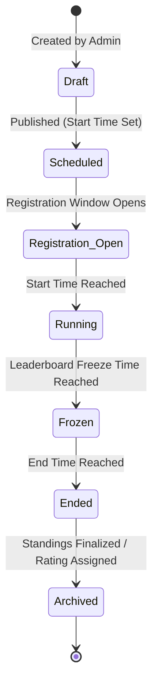

# BeastCode Platform Technical Documentation
## Section 06: Contest System, Standings, & Security Proctoring

### 6.1 Contest Lifecycle & Registration

The contest engine handles scheduling, admissions, real-time standings, and anti-cheat tracking.



#### Registration Admission Controls
BeastCode supports four levels of access:
1.  **Public**: Any logged-in user can register.
2.  **Private**: Admission restricted to manually whitelisted user accounts.
3.  **Password Protected**: Users must input a passcode. The verified session token is saved in `sessionStorage` (`contest_passcode_{cid}`).
4.  **University Restricted**: Compares the user's authenticated email domain against the contest domain string (e.g. `user@mit.edu` matches `mit.edu`).

---

### 6.2 Standings & Scoreboard Engine

Standings are aggregated in real time via Firestore queries on the `contest_submissions` collection.

#### A. Penalty & Ranking Algorithm
Ranking is determined by:
1.  **Points**: Higher solved problem points rank higher.
2.  **Penalty (Minutes)**: Tie-breaker. Lower penalty minutes rank higher.
    $$\text{Penalty} = \sum_{p \in \text{Solved}} (\text{Elapsed Minutes} + A_p \times K)$$
    Where:
    *   $\text{Elapsed Minutes}$: Time from contest start to the first Accepted (AC) submission.
    *   $A_p$: Count of incorrect attempts (WA, CE, TLE, MLE) for problem $p$ made *before* the first AC submission.
    *   $K$: Penalty multiplier minutes (default: 20 minutes per incorrect try).

#### B. Standings Freeze Mechanism
To preserve suspense, the leaderboard can be frozen towards the end of a contest (e.g., 15 minutes before the finish).
*   During a freeze, when the submission listener is triggered, the client updates the UI.
*   **For the current user**: Displays real-time grading updates (AC/WA/Score changes).
*   **For other participants**: The client hides their final submissions. Submissions made during the freeze increment their attempt count, but do not update their score or penalty on the public leaderboard.

---

### 6.3 Virtual Participation Mode

Virtual mode allows users to simulate active contests asynchronously:
*   **Activation**: User triggers `handleStartVirtual` on an archived contest.
*   **State Generation**: Creates a `contest_participants` document with:
    *   `isVirtual: true`
    *   `virtualStartTime: Date.now()`
    *   `status: "active"`
*   **Dynamic Offsets**: Counts down relative to the user's specific start time. Submissions made during this window are calculated using:
    $$\text{Solve Time} = \text{Submit Time} - \text{virtualStartTime}$$
*   **Standings Integration**: The virtual solver is placed on the leaderboard alongside the historical competitors' records, allowing them to compare their performance directly.

---

### 6.4 Secure Exam Mode & Anti-Cheat System

For high-stakes testing, BeastCode integrates browser-level security checks:

```mermaid
sequenceDiagram
    participant User as User Browser
    participant Client as React SPA Logic
    participant DB as Firestore (contest_participants)
    participant API as send-termination-email API

    User->>Client: Exits Fullscreen / Switches Tab / Blurs Window
    rect rgb(25, 20, 20)
        note over Client: Tab blur check includes 1200ms debounce
        Client->>DB: Increment warningsCount (warnCount++)
        Client->>DB: Log event in contest_integrity_events
        alt warningsCount < 3 (Standard Mode)
            Client-->>User: Open Warning Modal (Show count / 3)
            Client->>Client: Re-enter Fullscreen on click
        else warningsCount >= 3 (Standard) OR 1 Violation (Strict)
            Client->>DB: Set status = "terminated"
            Client->>Client: Exit Fullscreen & Lock Editor
            Client->>API: POST /api/send-termination-email
            API-->>User: Delivery Disqualification Alert Email
            Client-->>User: Show Disqualified Screen
        end
    end
```



#### A. Anti-Cheat Violations Checks
*   **Tab Switching**: Listens to `visibilitychange`. If `document.visibilityState === "hidden"`, it flags a violation.
*   **Window Blur**: Listens to the window `blur` event. Implements a `1200ms` debounce timer (`blurTimeoutRef`) to prevent false positives from brief system popups or notifications.
*   **Fullscreen Escaping**: Listens to `fullscreenchange`. If `document.fullscreenElement` is null, a violation is flagged.

#### B. Client-Side Exit Containment
*   **Browser Reloads**: Listens to the `beforeunload` event, prompting confirmation before allowing reloads.
*   **SPA Navigation Trapping**: Hooks into the Next.js router:
    ```typescript
    const handleRouteChange = (url: string) => {
      if (!url.startsWith(`/contests/${cid}/problems/`)) {
        router.events.emit("routeChangeError");
        alert("You cannot leave the workspace while the contest is active.");
        throw "Route change aborted";
      }
    };
    ```
    This blocks navigating away from the active contest interface until the timer runs out or the user is disqualified.
