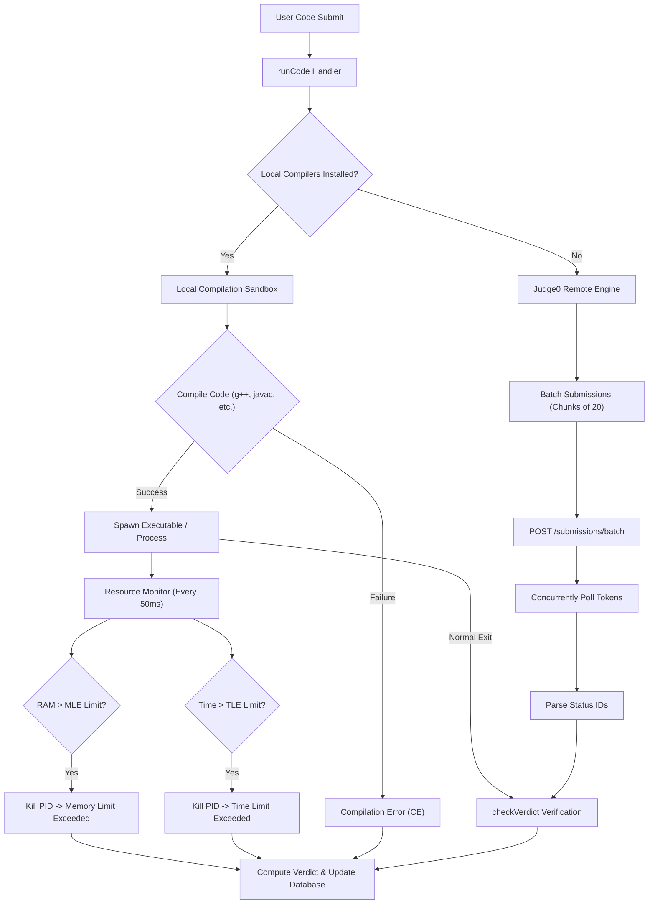

# BeastCode Platform Technical Documentation
## Section 07: Code Execution Engine & Sandbox Judge

### 7.1 Sandbox Judging Pipeline

The execution engine in BeastCode handles grading by compiling and running submissions. The judge uses a dual-engine architecture that balances performance with system availability.

---

### 7.2 Local Code Execution Sandbox

Local execution runs native binaries directly on the host server under strict process constraints.

#### A. Toolchains & Temp File Allocation
When a request starts, the judge allocates file paths inside `/tmp`:
*   **C++ (`g++`)**: Writes source code to `/tmp/unique_id.cpp`. Compiles using:
    `g++ -O3 /tmp/unique_id.cpp -o /tmp/unique_id`
*   **C (`gcc`)**: Writes to `/tmp/unique_id.c`. Compiles using:
    `gcc -O3 /tmp/unique_id.c -o /tmp/unique_id`
*   **Java (`javac`)**: Creates a class folder `/tmp/java_unique_id/`. Writes code to `/tmp/java_unique_id/Main.java`. Compiles using:
    `javac /tmp/java_unique_id/Main.java`
*   **Python (`python3`)**: Runs directly without compiling, writing scripts to `/tmp/unique_id.py`.

#### B. Process Monitoring & Resource Limits
After compiling, the runner spawns the executable using `child_process.spawn`. It monitors resource usage at 50ms intervals:
1.  **Memory Monitoring (`/proc/[pid]/statm`)**:
    On Linux systems, the judge queries `/proc/[pid]/statm` to check memory usage.
    *   Reads the second token (Resident Set Size - RSS in pages).
    *   Converts pages to kilobytes: $\text{RAM}_{\text{KB}} = \text{pages} \times 4$.
    *   If $\text{RAM}_{\text{KB}} > \text{Memory Limit}$, the judge terminates the process and returns `Memory Limit Exceeded (MLE)`.
2.  **Time Limit Enforcement**:
    *   Checks execution time against limits (default: 2000ms for C/C++, 4000ms for Python/Java).
    *   If running time exceeds the limit, the process is terminated and returns `Time Limit Exceeded (TLE)`.

---

### 7.3 Remote Judge0 Execution Engine

If local compilers are absent, the system routes requests to Judge0.

#### A. Multi-Endpoint Integration
Submissions are routed to separate endpoints based on language runtime requirements:
*   **Judge0 CE (Common Edition)**: Serves C, C++, Java, and JavaScript runtimes.
*   **Judge0 Extra CE (Extra Common Edition)**: Serves memory-heavy languages, including Python 3 execution tasks.

#### B. Batching & Polling Optimization
To support high-concurrency grading and prevent Judge0 `422 Unprocessable Entity` rate-limit errors:
1.  **Chunk Processing**: Submissions are divided into batches of 20.
2.  **Batch Submissions**: The judge calls `POST /submissions/batch` for the current batch.
3.  **Parallel Polling**: Instead of sequential requests, the system polls execution tokens concurrently, returning results as soon as processing completes.

---

### 7.4 Verdict Mappings

The grading engine maps execution statuses to standard competitive programming verdicts:

| Status ID | Verdict Name | Code / Reason | Description |
| :--- | :--- | :--- | :--- |
| **3** | **Accepted** | `Passed` | Stdin matches expected outputs according to checker rules. |
| **4** | **Wrong Answer** | `WA` | Actual stdout differs from expected outputs. |
| **5** | **Time Limit Exceeded** | `TLE` | Process exceeded execution time limits. |
| **6** | **Compilation Error** | `CE` | Compiler exited with a non-zero status. |
| **7..12** | **Runtime Error** | `RE` | Segfault, division by zero, uncaught exceptions, or non-zero exit codes. |
| **-** | **Memory Limit Exceeded** | `MLE` | Process exceeded RAM page limits. |
