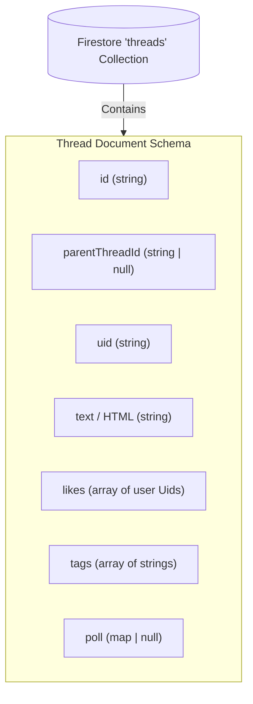

# BeastCode Platform Technical Documentation
## Section 08: Social Thread & Discussion Forum System

### 8.1 Forum Architecture & Model

The BeastCode social discussion system uses a single unified collection `threads` to represent both top-level forum posts and nested comments/replies. By utilizing self-referencing document relations, the forum supports recursive reply trees:



---

### 8.2 Nested Comment Trees & Query Optimization

Comments and replies are nested hierarchically. A child reply points to its parent post via the `parentThreadId` field.

#### Loading Nested Sub-Trees
To balance loading performance with database query limits, threads are loaded in two stages:
1.  **Top-Level Query**: The client fetches root-level threads where `parentThreadId == null`.
2.  **On-Demand Child Query**: When a user clicks to expand replies on a thread, the client queries for children documents in real time:
    ```typescript
    const q = query(
      collection(firestore, "threads"),
      where("parentThreadId", "==", parentId),
      orderBy("createdAt", "asc")
    );
    ```
    This approach fetches child replies only when needed, avoiding expensive database operations for collapsed comment threads.

---

### 8.3 Rich Composer Features

The discussion board features a rich editor (`ThreadComposer`) that supports multiple attachment types:

#### A. Interactive Polls
Users can attach polls to discussion threads. The poll schema is defined as:
```typescript
interface ThreadPoll {
  question: string;
  options: { text: string; votes: string[] }[]; // Array of UIDs that voted for each option
  expiresAt: number;
}
```
*   **Vote Toggling**: Clicking a poll option registers the user's vote. The system updates the option's votes array transactionally, ensuring a user can only vote for one option in a poll.

#### B. Media Attachments & Gifs
*   **GIF Search**: Integrates Giphy APIs via a custom picker, embedding selected GIFs directly into post markdown.
*   **Image Attachments**: Integrates with Cloud Storage. Files are validated for size and type, uploaded, and embedded as markdown images.

---

### 8.4 Social Actions & Notification Triggers

#### A. Like Toggling & Optimistic UI Updates
To ensure a responsive interface, the like action uses an optimistic UI update pattern:
1.  **Optimistic State Update**: When a user clicks the heart icon, the client immediately updates the local UI state (heart color and likes count).
2.  **Firestore Transaction**: The client sends the update to Firestore, checking the current likes array and appending or removing the user's UID.
3.  **Error Handling**: If the database write fails, the client rolls back the UI to its original state and displays an error message.

#### B. Notification Triggers
If the user liking or replying to a post is not the author, the client dispatches a notification through the API:

```typescript
// Example: Sending notification on quote repost
await clientSendNotification("THREAD_QUOTE", targetAuthorUid, {
  placeholders: {
    threadTitle: threadTitleText,
    replierName: currentUserName,
    excerpt: quoteTextExcerpt
  },
  ctaUrl: `/threads/${threadId}`,
  metadata: { threadId }
});
```

Supported social event triggers include:
*   `THREAD_LIKE`: Sent when a user likes a post.
*   `THREAD_REPLY`: Sent when a user comments on a thread.
*   `THREAD_MENTION`: Sent when a user is mentioned in a post content (parsed using `@username` syntax).
*   `THREAD_QUOTE`: Sent when a user quotes another post in their reply.
