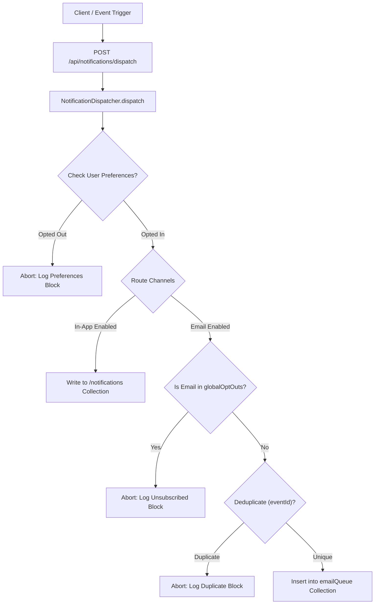

# BeastCode Platform Technical Documentation
## Section 09: Notification Dispatcher & Opt-Out System

### 9.1 Dispatcher Architecture

The notification engine handles message delivery across two channels: **In-App Alerts** (real-time Firestore records) and **Emails** (SMTP transactional queue).



---

### 9.2 Preference Routing & Opt-In Rules

Notifications are classified into categories to allow granular user preference checks:

```typescript
export type BeastNotificationCategory = "social" | "contest" | "security" | "marketing";
```

1.  **Preferences Evaluation**:
    Before routing, the system checks the recipient's preference document (`/users/{uid}`):
    ```typescript
    const categoryPrefs = userPrefs?.[category];
    const isChannelEnabled = categoryPrefs?.[channel] !== false; // Defaults to opt-in (true)
    ```
2.  **In-App Routing**:
    If in-app alerts are enabled, the dispatcher writes to `/notifications`:
    ```typescript
    await db.collection("notifications").add({
      uid: toUid,
      title,
      content,
      ctaUrl,
      read: false,
      timestamp: Date.now(),
      category
    });
    ```
3.  **Email Routing**:
    If email delivery is enabled, the message is placed in the queue.

---

### 9.3 Global Opt-Out & Unsubscribe Logic

To ensure compliance with email laws (e.g. CAN-SPAM, GDPR), the platform enforces opt-out rules:

#### A. Global Unsubscribe Collection (`globalOptOuts`)
The system maintains a blacklist collection `globalOptOuts` where documents are indexed by lowercased, MD5-hashed email addresses.

#### B. API Opt-Out Registration (`/api/unsubscribe`)
When a user clicks the unsubscribe link in an email:
1.  The request sends an email query parameter to the unsubscribe API.
2.  The backend normalizes and writes the address to `globalOptOuts`.
3.  Future queue processor runs check this collection before executing any email send operations, aborting delivery if a match is found.

---

### 9.4 Event Deduplication Engine

To prevent users from receiving duplicate emails for the same event (e.g., multiple reminder clicks or API retry triggers), the dispatcher uses a deduplication engine:

*   **Deduplication Keys (`eventId`)**: Every notification request requires a unique `eventId` string (e.g., `CONTEST_REMINDER_123_UID`).
*   **Audit Check**: Before enqueuing an email, the dispatcher queries the `notificationHistory` collection for a matching `eventId`.
*   **Execution Prevention**: If the query returns a record, the notification is discarded, and the API logs a `DUPLICATE_EVENT_BLOCKED` event to prevent spamming the user.
