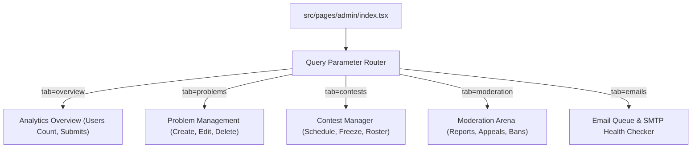

# BeastCode Platform Technical Documentation
## Section 10: Administrative Workflows & Dashboard

### 10.1 Unified Admin Dashboard (SPA Architecture)

The administrator dashboard in BeastCode (`src/pages/admin/index.tsx`) is designed as a Single Page Application (SPA). To prevent full page reloads, the interface uses query-based URL parameters (e.g., `/admin?tab=moderation`) for routing. This keeps active states intact and ensures a responsive experience.



---

### 10.2 Administrative Tabs & Capabilities

#### A. Contest Administration
*   **Creation & Scheduling**: Admins can set contest timing parameters, duration limits, and registration options.
*   **Problem Mapping**: Association interface to search the problem database, assign point values (e.g., A: 100pts, B: 250pts), and set display order.
*   **Passcode Configuration**: Generates and hashes credentials for password-protected private contests.

#### B. Problem Workspace Manager
*   **Drafting & Publishing**: Custom editor to input description markdown, memory/time limits, and code templates.
*   **Test Case Generator**: Interface to create, modify, and delete examples and test cases.
*   **Grading Configuration**: Select checker algorithms (Exact, Whitespace, Float, or Special Judge) and write grading scripts.
*   **Soft Deletion Staging**: Problem deletions are staging tasks. The system soft-deletes records to the `deleted_problems` collection, allowing admins to restore them if needed.

#### C. Trust & Safety Portal
*   **User Ban & Suspension Manager**: Select and issue temporary suspensions (1, 7, or 30 days) or permanent bans.
*   **Appeal Auditor**: View submitted ban appeals and choose to approve (restoring account status) or reject them.
*   **Report Resolver**: Dashboard displaying reported users, reason tags, and uploaded evidence screenshots.

---

### 10.3 Authorization Validation & Middleware

Administrative operations are secured on both the client and server:

#### A. Client-Side Page Guard
*   The admin view fetches the user document from `/users/{uid}` on load.
*   If the user's email is not in the hardcoded super-admin list and their database role is not `"admin"`, the view is blocked, and the page redirects to the home route.

#### B. Server-Side Route Guard
High-privilege API endpoints are protected using a verification middleware:
```typescript
export function withAdminGuard(handler: NextApiHandler) {
  return async (req: NextApiRequest, res: NextApiResponse) => {
    const authHeader = req.headers.authorization;
    if (!authHeader?.startsWith("Bearer ")) {
      return res.status(401).json({ success: false, message: "Unauthorized" });
    }
    const token = authHeader.split("Bearer ")[1];
    const decoded = await getAdminAuth().verifyIdToken(token);
    
    // Validate admin credentials in Firestore
    const userDoc = await getAdminFirestore().collection("users").doc(decoded.uid).get();
    const data = userDoc.data();
    
    const isSuperEmail = decoded.email in superAdminEmails;
    const isAdminRole = data?.role === "admin" || data?.isAdmin === true;
    
    if (!isSuperEmail && !isAdminRole) {
      return res.status(403).json({ success: false, message: "Access Denied" });
    }
    
    return handler(req, res);
  };
}
```

---

### 10.4 Moderation Logging & Audit Trails

To ensure accountability and prevent moderator abuse, all administrative actions are logged to the `/moderationLogs` collection. These logs are immutable (write-once, no delete, no update), creating a secure audit trail:

```json
{
  "logId": "log_897123912",
  "moderatorUid": "admin_uid_xyz",
  "moderatorEmail": "admin@test.com",
  "targetUid": "user_uid_123",
  "action": "BAN_TEMPORARY",
  "reason": "Repeated plagiarism detected in Contest 101",
  "durationDays": 7,
  "timestamp": 1782398412000
}
```
This logging system provides a clear history of all moderation actions for platform audits.
