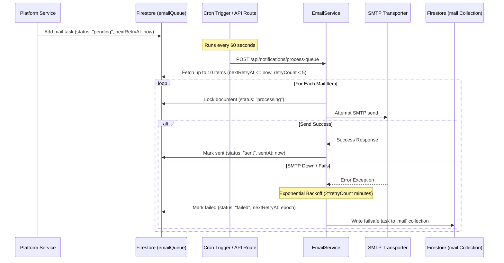

# BeastCode Platform Technical Documentation
## Section 11: Transactional Email Delivery Engine

### 11.1 Queue Processor Architecture

BeastCode utilizes a decoupled, queue-driven transactional email system. Instead of dispatching emails synchronously during user requests, the application queues mail tasks in Firestore. A background worker then processes this queue asynchronously. This design prevents request timeouts and protects against SMTP connection drops.

---

### 11.2 SMTP Configuration & Local Dev Mocking

The email service dynamically configures its outbound transport connection:

#### A. Production SMTP Settings
 Outbound connections are established using the following environment variables:
*   `SMTP_HOST`: Mail host address (e.g. `smtp.sendgrid.net`).
*   `SMTP_PORT`: Port connection (default: `587` for STARTTLS, or `465` for SSL).
*   `SMTP_USER` & `SMTP_PASS`: Authentication credentials.
*   `SMTP_FROM`: Outbound sender name (default: `"BeastCode System" <system@beastcode.codes>`).

#### B. Development Ethereal SMTP Fallback
If SMTP credentials are missing in local development, the service automatically sets up an **Ethereal Mail** server:
1.  Calls `nodemailer.createTestAccount()` with a 3000ms connection timeout.
2.  Creates a mock transporter using Ethereal's test credentials.
3.  Logs email preview links to the console:
    `[EmailService] Sent direct Ethereal test message preview: https://ethereal.email/message/abc...`
    This allows developers to inspect email styling and contents locally without using real credentials.

#### C. Database Failsafe Fallback
If both SMTP and Ethereal setups fail, the service writes the email to the `/mail` collection. This allows a secondary Firebase trigger (like the Firebase "Trigger Email" extension) to deliver the message if available.

---

### 11.3 Queue Processing & Retry Backoff Algorithms

The queue processor runs periodically (triggered by a cron job pointing to `/api/notifications/process-queue`):

1.  **Batch Fetching**: Queries `/emailQueue` for pending or failed emails where `nextRetryAt <= Date.now()`. It sorts them by retry time, processes up to 10 items per run, and filters out tasks that have exceeded 5 retries.
2.  **Concurrency Locking**: Before sending, the document is locked by setting `status: "processing"`. This prevents other container runs from picking up the same task.
3.  **Exponential Backoff Scheduling**:
    If delivery fails, the retry count increments, and a new execution time is scheduled using an exponential backoff formula:
    $$\text{Backoff Minutes} = 2^{\text{retryCount}}$$
    $$\text{nextRetryAt} = \text{Date.now()} + (\text{Backoff Minutes} \times 60 \times 1000)$$
    *   **Retry 1**: Runs in 2 minutes.
    *   **Retry 2**: Runs in 4 minutes.
    *   **Retry 3**: Runs in 8 minutes.
    *   **Retry 4**: Runs in 16 minutes.
    *   **Retry 5**: Runs in 32 minutes. After this, the task is marked as permanently failed.

---

### 11.4 Branded HTML Email Templates

Outbound templates (`src/utils/notificationTemplates.ts`) feature standard layouts:

*   **Platform Branding**: CSS inline-styled header featuring the BeastCode logo and brand colors.
*   **Action Call-to-Actions (CTAs)**: Primary colored button links centered in the body layout.
*   **Footer Compliance**: Includes physical address indicators and a direct link to the unsubscribe page (`https://beastcode.codes/unsubscribe?email={userEmail}`).
