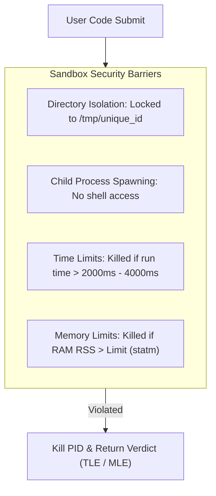

# BeastCode Platform Technical Documentation
## Section 12: Security Hardening & Trust & Safety Audits

### 12.1 Sandbox Execution Constraints

The code execution engine is designed with security controls to protect the host server from malicious scripts (e.g., system takeovers, filesystem exploits, memory exhaustion).



1.  **Directory Isolation**: Compilation occurs in isolated subdirectories under `/tmp`. Process write permissions are restricted, preventing access to host config files.
2.  **No Shell execution**: Processes are spawned using Node's `spawn` with an array of arguments, bypassing shell parsing to prevent command injection exploits.
3.  **RAM RSS Monitoring**: Querying `/proc/[pid]/statm` page allocations every 50ms ensures memory limits are enforced at the OS process level. Slow processes are killed immediately.

---

### 12.2 Firestore Access Control & Rules Audits

Security policies are defined in `firestore.rules`. Access control is enforced using the following rules:

#### A. Document Write Guards
Clients are restricted from writing directly to sensitive collections. All operations on `/userModeration`, `/emailQueue`, `/deleted_problems`, and `/contest_integrity_events` must go through secure Next.js API endpoints, which validate authorization tokens before processing.

#### B. Ownership Verification
Update actions on user profiles, submissions, and thread comments require ownership verification:
```javascript
allow update: if signedIn() && resource.data.uid == request.auth.uid;
```
This rule prevents unauthorized users from editing or deleting resources owned by others.

---

### 12.3 Account Deletion & Appeal Lifecycles

To prevent accidental data loss and allow banned users to appeal, account deletions follow a structured lifecycle:

```mermaid
stateDiagram-v2
    [*] --> Active : Normal Operation
    Active --> Pending_Deletion : Admin Schedules Deletion (14-day delay)
    
    state Pending_Deletion {
        [*] --> Appeal_Submitted : User submits appeal
        Appeal_Submitted --> Appeal_Approved : Admin approves appeal
        Appeal_Submitted --> Appeal_Rejected : Admin rejects appeal
    end
    
    Appeal_Approved --> Active : Status restored, deletion canceled
    Appeal_Rejected --> Purged : Immediate database purge
    Pending_Deletion --> Purged : 14-day window expires without appeal
    Purged --> [*]
```

1.  **Deletion Scheduling**: When an administrator schedules an account deletion, the system marks the user's status as `PENDING_DELETION` and sets a deletion epoch timestamp (default: 14-day delay).
2.  **The 14-Day Grace Period**: During this buffer window, the user's profile is hidden, and their active sessions are revoked. The user can submit an appeal through the `/account-appeal` interface.
3.  **Appeals Evaluation**:
    *   **Approved**: The system restores the user's status to `active` and cancels the deletion task.
    *   **Rejected / Expired**: The backend cron job purges the user's records across all collections (submissions, comments, profiles, etc.).
4.  **Immediate Purge Override**: Super-administrators can bypass this grace period to immediately delete accounts in cases of severe platform abuse.

---

### 12.4 Moderation Controls & Safeguards

#### A. Moderator Action Auditing
All actions performed by moderators or administrators (e.g., warnings, bans, appeal resolutions) are logged to the `/moderationLogs` collection. This collection is write-only, creating an immutable audit trail that prevents moderator abuse.

#### B. User Reporting Rate Limits
To prevent users from spamming the reporting system, the `/api/moderation/report` endpoint enforces rate limits:
*   Users are limited to a maximum of **5 reports per day**.
*   The system checks submission rates by querying `/userReports` matching the sender's UID:
    ```typescript
    const todayStart = new Date().setHours(0,0,0,0);
    const reportsCount = await db.collection("userReports")
      .where("reporterUid", "==", reporterUid)
      .where("timestamp", ">=", todayStart)
      .get();
    ```
*   If the count exceeds 5, the request is blocked. Additionally, file uploads are restricted to a maximum size of **5MB** to prevent storage exhaustion attacks.
