# BeastCode Platform Technical Documentation
## Section 16: Future Feature Roadmap

This roadmap outlines planned features to improve performance, security, and integration on the BeastCode platform.

---

### 16.1 High-Performance Caching Layers

#### A. Redis Standings Cache
During high-traffic contests, querying Firestore for every leaderboard update can exceed database limits and increase costs.
*   **Redis Caching**: Cache standings updates in Redis. The system will read contest submissions from Firestore, calculate rankings, and store the leaderboard in Redis.
*   **Standings Refresh**: The leaderboard will update every 10 seconds, reducing Firestore read operations by up to 90% during active contests.

#### B. Compilation Result Caching
*   **Hash-Based Cache**: The sandbox judge will hash submission files (combining code and problem test cases).
*   **Execution Skipping**: If a matching hash exists in the cache, the judge will skip execution and return the cached verdict. This optimizes resources when users submit identical code runs repeatedly.

---

### 16.2 Proctoring Controls & AI Verification

To support high-stakes examinations, the platform plans to expand its security features:

```mermaid
graph TD
    UserCam["Webcam Video Stream"] --> FaceDetector["WebRTC Canvas Capturer"]
    FaceDetector --> AI_Check{"Face Detection Checks"}
    
    AI_Check -->|No Face Detected| AlertMod["Trigger Proctor Warning Event"]
    AI_Check -->|Multiple Faces| AlertMod
    AI_Check -->|Normal| ActiveExam["Continue Exam"]
```

1.  **AI Proctoring Integration**: Use TensorFlow.js in the browser for face detection. If no face is detected, or if multiple faces are present, the system will flag a warning.
2.  **Audio Monitor**: Capture ambient audio levels through WebRTC. Significant noise events will trigger integrity logs in the database.
3.  **Proctor Audit Feed**: Real-time interface for supervisors to monitor participants' proctor logs during active exams.

---

### 16.3 Development Tool Integrations

*   **BeastCode IDE Extension**: Plugins for VS Code and JetBrains IDEs to allow users to pull problems, write code, and run tests directly in their local editor.
*   **Command Line Tool (`beast-cli`)**: Terminal tool to manage submissions and run local tests from a CLI interface:
    `beast run two-sum.py`

---

### 16.4 Machine Learning Code Analysis

*   **AI Code Assistant**: Integrate Google Gemini APIs to provide tailored hints when users get stuck on a problem. Hints will be rate-limited and disabled during active contests.
*   **Complexity Scoring**: Static code analyzer to estimate time and space complexity ($O(N)$, $O(\log N)$) and suggest optimizations after a solution is accepted.
