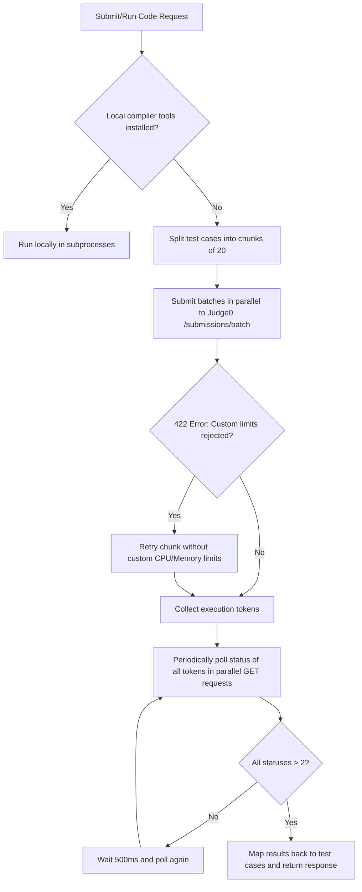

# BeastCode Project Summary

BeastCode is a high-fidelity competitive programming and online judge platform (similar to LeetCode). It supports real-time coding, submission history, rankings, contest management, and an execution engine that runs user-submitted code either locally on the host or remotely via the Judge0 API.

---

## 🚀 Key Technologies & Stack
*   **Frontend Framework**: Next.js (React) with TypeScript.
*   **Styling**: Tailwind CSS & Vanilla CSS with support for multiple themes (Dark, Light, Sakura, Red) and theme-aware UI components.
*   **State Management**: Recoil (atoms) for global reactive states (e.g., auth modal, active theme).
*   **Backend & DB**: Firebase (Cloud Firestore, Firebase Authentication, Firebase Storage, and Firebase Cloud Functions/Admin SDK).
*   **Code Execution Engines**:
    *   **Local Execution**: Uses local host CLI tools (`python3`, `g++`, `gcc`, `javac`) to build/run code within standard limits.
    *   **Remote Execution**: Integrates with Judge0 API (`ce.judge0.com` and `extra-ce.judge0.com`) to compile and execute submissions.
*   **Mailing System**: Nodemailer for sending contest registrations, reminders, terminations, and virtual mode updates.
*   **Monetization**: Stripe API integration for handling payment intents.

---

## 📂 Project Directory Structure

```
leetcode-clone-youtube/
├── .env.local             # Local environment secrets (Firebase, Judge0, Stripe, Mailer)
├── .env.production        # Production environment config
├── apphosting.yaml        # Firebase App Hosting configuration
├── firebase.json          # Firebase CLI configuration
├── firestore.rules        # Security rules for Cloud Firestore
├── firestore.indexes.json # Composite indexes for Firestore queries
├── package.json           # Scripts and dependency declarations
├── public/                # Static assets (images, logos, etc.)
├── scripts/               # Server utility and inspection scripts
│   ├── inspect-problem.js # Inspects problem test cases and submissions in Firestore
│   └── test-firestore.js  # Test database connectivity
└── src/
    ├── atoms/             # Recoil state atoms (auth, theme, etc.)
    ├── components/        # Reusable UI React components (Modals, Workspace, Topbar, etc.)
    ├── firebase/          # Firebase client and admin initialization code
    ├── hooks/             # Custom React hooks (auth, profile, windows, etc.)
    ├── mockProblems/      # Initial mock problems data
    ├── pages/             # Next.js Pages router and API routes
    │   ├── admin/         # Admin Panel pages (Contest management, problems creation)
    │   ├── api/           # API handlers (Run code, Submit, Recount, Payments, Mailing)
    │   ├── auth/          # Authentication pages
    │   ├── contests/      # Contest hub pages
    │   ├── problems/      # Problem workspace page: `[pid].tsx`
    │   ├── index.tsx      # Main Home page / Problem List
    │   ├── profile.tsx    # User Profile page
    │   └── settings.tsx   # User Account Settings page
    ├── styles/            # Theme tokens, custom animations, and CSS rules
    └── utils/             # Execution profiles, helper tools, and check verifiers
```

---

## ⚙️ Execution Pipeline (Local vs. Remote)

When a user runs or submits code, the platform routes execution dynamically through `/src/pages/api/run.ts`.

### 1. Engine Routing
The runner checks if compile tools are available locally on the system. If they are missing, it falls back to the remote **Judge0 CE API**:
*   **C, C++, Java, JS**: Executed via the main API at `https://ce.judge0.com`
*   **Python**: Executed via the Python ML API at `https://extra-ce.judge0.com` (which includes advanced ML modules like NumPy).

### 2. Execution Profiles & Limits
Profiles (`fast`, `normal`, `long`, `machine_learning`) specify default timeout thresholds (e.g., `2000ms`), memory usage (e.g., `256MB`), and stdout character lengths. They can be overriden at the problem level by admins.

---

## ⚡ Recent Optimizations: Batch Execution & Polling

Initially, submissions with many test cases (e.g., *The King's Road Network* has 100 test cases) were extremely slow. We re-engineered the Judge0 pipeline to resolve this:



### Key Technical Improvements:
*   **Request Chunking (Limit Bypass)**: The public Judge0 API enforces a batch limit of `20` (`MAX_SUBMISSION_BATCH_SIZE`). Sending 100+ test cases at once returned a `422 Unprocessable Entity` error. We chunk submissions into batches of size **20** and execute them concurrently via `Promise.all`.
*   **Parallel Polling**: Instead of querying statuses one-by-one, we poll all token chunks simultaneously.
*   **Serverless Thread Preservation**: Background promises in `src/pages/api/submit.ts` are guarded to complete execution safely before Next.js/Vercel thread suspension occurs.

---

## 💾 Firestore Database Collections

*   **`users`**: User records, usernames, solved problem lists, and rankings.
*   **`problems`**: Problem declarations, description markdown, starter code, testcases (`examples`), points, and `executionProfile` configurations.
*   **`submissions`**: Log of submission history, verdicts (Accepted, Wrong Answer, Runtime Error, Time Limit Exceeded, Compilation Error), score, source code, language, and run metadata.
*   **`contests`**: Contest instances containing name, rules, starting/ending timestamps, and participant limits.
*   **`contest_submissions`**: Sandbox submission logs exclusive to running contests.
*   **`contest_problems`**: Mapping problem assignments to active contests.
*   **`contest_participants`**: Registry of enrolled contestants.
